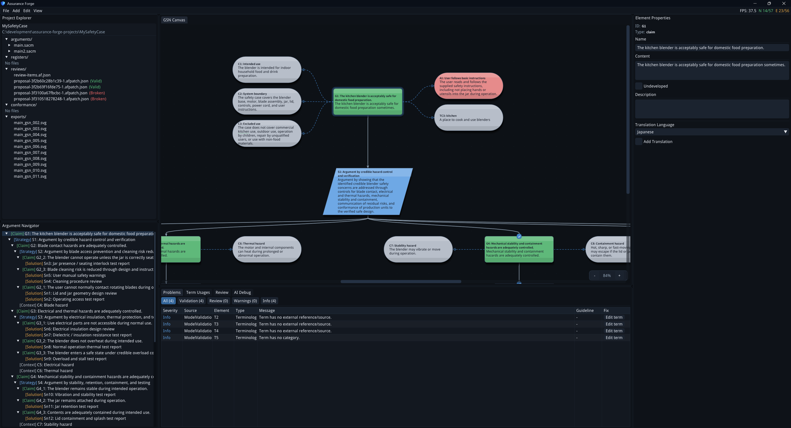
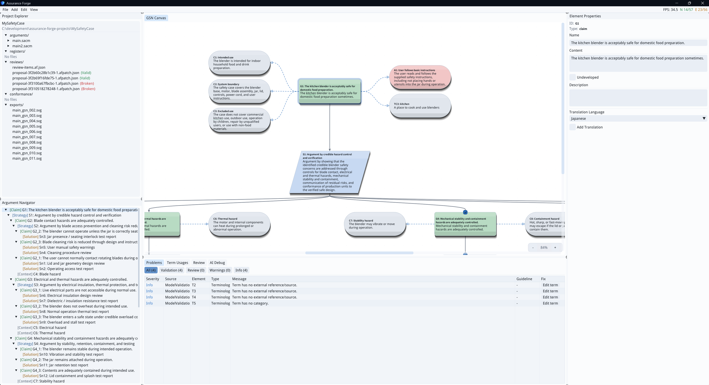

# Assurance Forge — Safety Case Engineering Tool

Assurance Forge is an open-source tool for safety case development, review, and navigation. It is built around the SACM (Structured Assurance Case Metamodel) standard and designed for safety engineers who need a rigorous, efficient workflow for constructing and maintaining assurance arguments.




---

## ✨ Vision

Safety cases are critical artifacts in safety-critical systems engineering, yet the tooling available today is often heavyweight, expensive, or disconnected from the engineering lifecycle. Assurance Forge aims to change that.

The vision is to make safety cases **easier to develop, review, and navigate** — and to connect them to the broader engineering context through open standards.

### What Assurance Forge delivers today

- **Automatic layout** — Assurance arguments are visualized automatically. Engineers focus on content, not diagram maintenance. No manual positioning of nodes.
- **GSN visualization** — Safety arguments are rendered using Goal Structuring Notation (GSN), providing a clear, standardized view of the assurance case.
- **Manual and AI-assisted reviews** — Integrated AI assistance evaluates arguments against the Safety Case Core Guidelines (SCCG), helping teams identify weaknesses and improve argument quality.
- **SACM-first** — The tool consumes and produces SACM 2.3 XML. Internal structures closely follow SACM concepts, ensuring standards conformance.
- **Fully open source** — MIT licensed with no vendor lock-in for AI providers.

### Future direction

Assurance Forge is designed to grow alongside the evolving safety engineering landscape. Planned integrations include:

- **RAAML** — Hazard and risk model integration to connect hazard analysis directly to safety arguments
- **ReqIF** — Requirements interchange for traceability between requirements and assurance claims
- **OSLC RM/QM** — Live lifecycle links to requirements management and quality management tools, and SPI (Safety Performance Indicators) support
- **GSN extensions** — Dialectic Extensions/Challenges (defeater resolution), Modular Extensions (contracts and away elements), Confidence Arguments Extension (ACP), and patterns
- **CAE** — Claim Argument Evidence notation
- **Safety Case Report** — Produce your own safety case report as LaTeX and PDF
- **Standard Conformance** — Conduct conformance assessment for UL 4600, ISO 26262 or other standards
- **J3377 Assessment process** — Conduct assessment in accordance with J3377 or ASCV CSE.
- And much more, driven by community needs and safety engineering standards

Feel free to drop an idea in the [Discussion forum](https://github.com/lasrod/assurance-forge/discussions/categories/ideas) if there is anything you would like to see in the tool.

---

## 📦 Releases

Pre-built Windows binaries are published on the [Releases page](https://github.com/lasrod/assurance-forge/releases).

1. Download `assurance-forge.<version>-windows-x64.zip` from the latest release.
2. Unzip anywhere.
3. Run `assurance-forge.exe` from the extracted folder.

Each zip contains the executable, the `data/` sample files, `README.md`, and `LICENSE.md`.

Releases are currently Windows x64 only. To build on other platforms, see [Build Instructions](#build-instructions) below.

---
## Requirements

- Windows 10/11, Linux, or macOS
- [CMake](https://cmake.org/) 3.20 or newer
- A C++17 compiler, such as Visual Studio 2022, GCC, or Clang
- [Git](https://git-scm.com/download/win)

The application uses `hello_imgui` with GLFW/OpenGL as its UI backend and Native File Dialog Extended for OS-native file and folder pickers.

## Build Instructions

### 1. Prepare a C++ Build Environment

On Windows, launch "Developer Command Prompt for VS 2022" from the Start menu.

Or in cmd:

```cmd
"C:\Program Files (x86)\Microsoft Visual Studio\2022\BuildTools\VC\Auxiliary\Build\vcvars64.bat"
```

On Linux or macOS, use a shell where CMake and your C++ compiler are available on `PATH`.

### 2. Clone and Initialize Submodules

```bash
git clone <repository-url>
cd assurance-forge
git submodule update --init --recursive
```

### 3. Configure and Build

**Windows** (Visual Studio):

```bash
cmake --preset default
cmake --build --preset release
```

**Linux** (install dependencies first):

```bash
sudo apt-get install xorg-dev libgl1-mesa-dev libglu1-mesa-dev libgtk-3-dev
cmake -B build -DHELLOIMGUI_DOWNLOAD_GLFW_IF_NEEDED=ON -DCMAKE_BUILD_TYPE=Release
cmake --build build
```

**macOS**:

```bash
cmake -B build -DCMAKE_BUILD_TYPE=Release
cmake --build build
```

### 4. Run the Application

**Windows**:

```bash
build\Release\assurance-forge.exe
```

**Linux**:

```bash
./build/assurance-forge
```

**macOS**:

```bash
open build/assurance-forge.app
```

### 5. Run Tests

**Windows**:

```bash
ctest --preset release
```

**Linux / macOS**:

```bash
ctest --test-dir build --output-on-failure
```

Or run the test executable directly:

**Windows**:

```bash
build\Release\tests.exe
```

**Linux / macOS**:

```bash
./build/tests
```

### 6. Code Coverage (Linux)

A dedicated GitHub Actions workflow (`.github/workflows/coverage.yml`)
generates HTML coverage reports for the Linux build using `gcovr` and
GCC 14. To produce the same reports locally, configure with
`-DENABLE_COVERAGE=ON` and use a GCC 14 toolchain. See
[docs/COVERAGE.md](docs/COVERAGE.md) for the full procedure and the
rationale behind the gcovr flags and the two report views.

## Usage

1. Launch the application
2. Enter the path to a SACM XML file (default: `data/sample.sacm.xml`)
3. Click "Load" to parse and display the assurance case elements
4. Elements are color-coded by type:
   - Green: Claims (Goals)
   - Blue: Argument Reasoning (Strategies)
   - Orange: Artifacts and Evidence

## Sample Data

A minimal sample file is included at `data/sample.sacm.xml`.

For a more comprehensive example, download the Open Autonomy Safety Case:
https://github.com/EdgeCaseResearch/oasc

## Troubleshooting

**"The CXX compiler identification is unknown"**
- Run from Developer Command Prompt for VS 2022, not regular PowerShell/cmd

**Build fails on Linux with missing OpenGL or X11 headers**
- Install the OpenGL/X11 development packages shown in the Linux build example

**Application starts but window is blank**
- Ensure your GPU and drivers support OpenGL

**Tests fail to build**
- GoogleTest is fetched automatically; ensure internet connection during first build

## Dependencies

- [hello_imgui](https://github.com/pthom/hello_imgui) - Cross-platform Dear ImGui application runner (MIT License)
- [Dear ImGui](https://github.com/ocornut/imgui) - Immediate mode GUI, supplied by hello_imgui (MIT License)
- [Native File Dialog Extended](https://github.com/btzy/nativefiledialog-extended) - Native file and folder dialogs (Zlib License)
- [PicoSHA2](https://github.com/okdshin/PicoSHA2) - Header-only SHA-256 implementation (MIT License)
- [pugixml](https://github.com/zeux/pugixml) - XML parser (MIT License)
- [GoogleTest](https://github.com/google/googletest) - Testing framework, fetched via CMake (BSD-3-Clause)
- [Noto Sans JP](https://github.com/notofonts/noto-cjk) - Bundled font for Latin and Japanese rendering (SIL Open Font License 1.1)


## Copyright and license
Code and documentation copyright 2026 Jesper Brännström. Code released under the [MIT License](LICENSE.md)