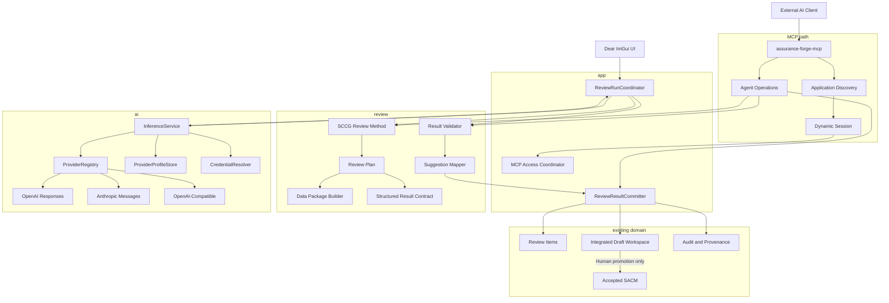
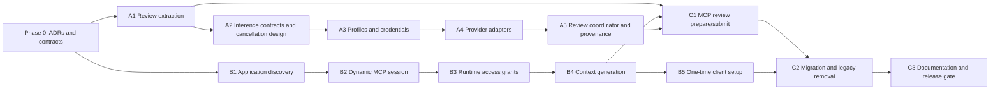

# Provider-neutral AI reviews and projectless MCP — implementation plan

- **Status:** Planned. Decisions recorded in
  [ADR 0013](decisions/0013-review-methods-independent-of-inference-providers.md),
  [ADR 0014](decisions/0014-projectless-mcp-discovery-with-runtime-case-binding.md) and
  [ADR 0015](decisions/0015-versioned-provider-profiles-and-fail-closed-selection.md).
- **Date:** 2026-08-15
- **Parent epic:** [lasrod/assurance-forge#388](https://github.com/lasrod/assurance-forge/issues/388)
  (A1: #389, B1: #390)
- **Scope:** Long-term replacement of the current single-provider AI review
  configuration and project-bound MCP setup
- **Product principle:** AI may review and propose. Only a human may promote
  changes into the accepted assurance case.

This page is the delivery plan for the decisions those three ADRs record. The
ADRs say *what* and *why*; this says *in what order*, *against which files*, and
*what has to be true before a phase is finished*. Where the two disagree, the
ADRs win.

---

## 1. Executive summary

Assurance Forge currently has two independent AI paths:

1. **Built-in SCCG-guided review**, initiated from the Assurance Forge UI and
   executed through a directly configured OpenAI API key.
2. **External AI access through MCP**, initiated from clients such as Claude
   Desktop, Claude Code, or Cursor.

Both paths already feed into the same human-controlled review and draft
workflow, but both have important long-term limitations:

- Built-in review is effectively tied to one provider, one model setting, and
  one API-key credential.
- The MCP client configuration embeds a project path and therefore has to be
  recreated for every project.
- The MCP bridge is discovered by project path, so project selection is treated
  as launch configuration rather than live application context.
- The current MCP consent gate is machine-wide and does not distinguish one
  project, client, or session from another.
- The current AI layer owns both provider communication and SCCG review-method
  behavior, which prevents clean reuse by external AI clients.
- Unknown provider settings currently fall back to OpenAI instead of failing
  closed.

The final architecture separates three concerns:

```text
Review method
    Defines what to review, what data is needed, how the request is expressed,
    and how a result is validated.

Inference runtime
    Sends a provider-neutral generation request to a configured provider and
    returns a normalized result.

MCP integration
    Lets an external AI client read and propose against the assurance case
    currently shared by the running application.
```

The target result is:

- **One SCCG review engine**
- **One provider-neutral inference runtime**
- **One integrated working draft**
- **One human-controlled promotion path**
- **One global MCP client configuration**
- **Explicit runtime binding between an MCP session and a project**
- **No MCP Sampling dependency**
- **No project path in normal MCP client configuration**
- **No silent provider fallback**
- **No silent project retargeting**

---

## 2. Existing architecture that must be preserved

This plan builds on several decisions that are already correct and should
remain intact.

### 2.1 Existing decisions

- [ADR 0005 — Provider-agnostic AI with explicit user consent](decisions/0005-provider-agnostic-ai-with-user-consent.md)
- [ADR 0007 — Explicit consent for sharing assurance cases over MCP](decisions/0007-mcp-server-consent.md)
- [ADR 0008 — One owner for the open project](decisions/0008-one-owner-for-the-open-project.md)
- [ADR 0009 — One integrated working draft per argument](decisions/0009-one-integrated-working-draft-per-argument.md)
- [ADR 0010 — Draft provenance, persistence, and human-controlled promotion](decisions/0010-draft-provenance-persistence-and-human-promotion.md)
- [Layers and ownership](layers-and-ownership.md)
- [Current MCP design](../features/mcp-server.md)
- [Capability matrix](../features/feature-matrix.md)

### 2.2 Invariants that remain unchanged

1. The running Assurance Forge application is the sole owner of an open project.
2. Connected MCP operations execute against the model the user is looking at.
3. Draft operations never modify accepted SACM.
4. Draft operations create no accepted-model audit transaction.
5. Human promotion is the only path from draft state to accepted SACM.
6. Promotion remains audited, replayable, and undoable.
7. MCP never exposes an `apply`, `accept`, or `promote` operation.
8. The MCP transport remains local IPC, not TCP.
9. The bridge remains protected by operating-system access control and a random
   token.
10. User consent defaults to off and fails closed.
11. MCP and provider credentials remain separate.
12. `mcp`, `agent`, and `bridge` must not depend on the provider/inference
    layer.
13. Safety-case content is sent externally only after an explicit user action or
    an explicitly granted MCP session.
14. AI output is treated as untrusted input until locally validated.
15. Suggestions enter the integrated working draft and remain visible before
    acceptance.

---

## 3. Problems to solve

### 3.1 Built-in review is only superficially provider-neutral

The repository already has an `IAiProvider` interface, but the current
implementation still has these limitations:

- `AiProviderId` contains only OpenAI (`src/ai/ai_types.h`).
- `AiService` receives one provider instance and directly loads one OpenAI API
  key from one hard-coded secure-store account.
- The runtime constructs `OpenAiProvider` directly
  (`src/app/app_runtime_state.cpp`).
- Shared AI types contain OpenAI-specific constants (`src/ai/ai_types.h`).
- Unknown provider strings fall back to OpenAI unconditionally
  (`AiProviderIdFromString` in `src/ai/ai_types.cpp`).
- The settings model contains one provider, one model, one enabled flag and one
  consent flag, with no schema version.
- The Preferences UI presents a fixed provider and one API-key field.
- SCCG review data packaging, prompt construction and response parsing live
  inside `src/ai/ai_claim_review.*` — while SCCG review *profile selection*
  is stranded in `src/app/controllers/ai_review_controller.*`
  (`SelectReviewProfileForElement`). The method is split across two layers,
  neither of which should own it.
- The OpenAI adapter already implements strict JSON-schema structured output,
  but the review path never uses it: the expected shape is appended to the
  prompt as prose and the reply is defensively code-fence-stripped. Today's
  review runs in what the target architecture calls the degraded
  `PromptedJson` mode.

This is not sufficient for a long-term provider-neutral architecture.

### 3.2 MCP setup is bound to one project

The generated configuration currently has this form:

```json
{
  "mcpServers": {
    "assurance-forge": {
      "args": [
        "--project",
        "C:/development/assurance-forge-projects/Demo2"
      ],
      "command": "C:/development/assurance-forge/build/Release/assurance-forge-mcp.exe"
    }
  }
}
```

The project path is not merely a UI inconvenience. It is currently required by
several parts of the implementation:

- `BuildMcpClientConfig(project_root)` writes `--project`.
- `assurance-forge-mcp` refuses to start without a project path — supplied via
  `--project` or the `AF_MCP_PROJECT` environment variable (a second supply
  route the cutover must also remove).
- `Session::Open` loads or connects to that project.
- Bridge endpoint records are keyed by the normalized project path.
- The application stops and recreates the bridge listener when switching
  projects.
- Offline mode assumes that the configured project is the project to load.

A global configuration requires a full runtime redesign rather than deleting
one command-line argument.

### 3.3 Current MCP authorization is too coarse

The existing `mcp.enabled` setting is an important master gate, but it
currently grants all local MCP clients access to all projects once enabled.

The final design must additionally distinguish:

- one client session from another;
- one Assurance Forge instance from another;
- one project from another;
- one project context generation from another.

### 3.4 A long-running AI conversation must not silently change projects

Removing the project path introduces a serious semantic risk.

An AI conversation that began against Project A must never start reading or
editing Project B because the user opened another project in Assurance Forge.

Today this cannot happen only *by accident*: the session is pinned to its
launch path, so a project switch makes it error with "not reachable" rather
than follow. Removing the path removes that accidental protection, so the
session needs an explicit runtime binding to a project. Project switching must
invalidate or suspend that binding until the user explicitly approves a new
one.

### 3.5 Review methodology and inference transport are mixed

The current `src/ai/ai_claim_review.*` code (plus the profile selection in
`src/app/controllers/ai_review_controller.*`) owns behavior that is not
provider-specific:

- selecting SCCG review profiles;
- collecting argument context;
- building review data packages;
- building review instructions;
- defining the expected result schema;
- validating returned guideline and element identifiers;
- parsing review findings;
- mapping corrections into proposed changes.

These responsibilities belong in a review-method layer that can be reused by
both:

- the in-app review workflow; and
- an external AI client through MCP.

---

## 4. Goals

### 4.1 End-user goals

- [ ] Configure an MCP client once, not once per project.
- [ ] Open any project in Assurance Forge without changing MCP configuration.
- [ ] See which external AI client is connected.
- [ ] Explicitly approve the current project for that client.
- [ ] Prevent an existing conversation from silently moving to another project.
- [ ] Configure one or more built-in AI connections through a guided UI.
- [ ] Select which connection is used for SCCG review.
- [ ] Run SCCG review from the Assurance Forge UI.
- [ ] See the provider, model, scope, and destination before sending project
      data.
- [ ] Cancel a running review.
- [ ] Receive findings and suggestions through the existing review and draft
      workflow.
- [ ] Use Assurance Forge without any AI connection.
- [ ] Use MCP without configuring built-in AI.
- [ ] Use built-in AI without configuring MCP.

### 4.2 Architecture goals

- [ ] Extract SCCG review-method behavior from `src/ai` (and the profile
      selection from `src/app`).
- [ ] Create a provider-neutral inference runtime.
- [ ] Add versioned provider profiles.
- [ ] Store credentials by profile in platform secret storage.
- [ ] Fail closed for unknown providers, models, credentials, capabilities, and
      endpoints.
- [ ] Support at least two genuinely different provider protocols.
- [ ] Support configurable OpenAI-compatible endpoints for enterprise and local
      use.
- [ ] Keep the provider layer independent of SCCG and assurance-case concepts.
- [ ] Keep MCP independent of the provider layer.
- [ ] Reuse the same review method and validator for built-in and MCP-driven
      review.
- [ ] Introduce application-level MCP discovery.
- [ ] Bind MCP sessions to a project at runtime, with the current argument
      reported in every response envelope.
- [ ] Add context-generation checks in addition to working-draft revision
      checks.
- [ ] Persist sufficient review provenance to explain every AI finding.
- [ ] Preserve human-controlled promotion.

### 4.3 Safety and trust goals

- [ ] Never send assurance-case data before explicit consent.
- [ ] Never silently select a different provider or model.
- [ ] Never silently retarget an MCP session to another project.
- [ ] Never silently truncate a review payload.
- [ ] Never accept provider output without local validation.
- [ ] Never create partial findings or draft groups after a failed run.
- [ ] Never store API keys, tokens, or credentials in project files.
- [ ] Never write unaccepted AI work into SACM.
- [ ] Never let an AI accept its own changes.
- [ ] Make provider, model, method, scope, and reviewed snapshot traceable.

---

## 5. Non-goals

- No MCP Sampling implementation.
- No attempt to treat Claude Desktop, ChatGPT, Cursor, or another consumer
  application as a generic background inference service.
- No in-app chat panel in this work.
- No unattended acceptance.
- No automatic repeated paid review loop.
- No automatic cross-provider fallback.
- No "pick the newest running Assurance Forge instance" heuristic.
- No automatic loading of the most recently opened project when the application
  is absent.
- No plaintext secret-file fallback.
- No arbitrary native C++ provider-plugin ABI in the first final architecture.
- No promise that a consumer ChatGPT or Claude subscription can authorize
  third-party API use.
- No changes to `libs/sacm` solely for this architecture.
- No new SACM semantics for proposed or AI-authored content.
- No direct provider calls from `mcp`, `agent`, `bridge`, `ui`, `core`, or
  `parser`.
- No project-specific MCP configuration generated after the cutover.
- No deterministic scope partitioning in the first implementation — oversized
  scopes are refused with an explanation (see 10.5); partitioning is follow-up
  work.

---

## 6. Decisions recorded

The three governing ADRs are accepted. The summaries below include the
decisions settled during plan review; the ADRs are authoritative.

### 6.1 ADR 0013 — Review methods are independent of inference providers

- SCCG review behavior belongs in a dedicated `review` layer: scope, data
  packaging, instructions, result contracts, and result validation.
- The inference layer knows nothing about SCCG, GSN, SACM, review items, or
  draft groups. Neither `review` nor `ai` may depend on the other; `app`
  composes them. `agent` may use `review`; `mcp` reaches review behavior only
  through `agent`. No provider adapter may create findings or draft
  operations.
- **A review result is validated against the scope it reviewed.** Staleness is
  keyed to a deterministic semantic hash of the reviewed elements and included
  data packages (plus the project/argument context), not to the global working
  revision — an unrelated edit does not invalidate a completed review. The
  working revision at review time is recorded as provenance. Draft *mutations*
  keep their existing `expected_working_revision` check.
- Failed, cancelled, or stale runs commit nothing (atomic result commitment).

This ADR partially clarifies the prompt-ownership wording in ADR 0005.

### 6.2 ADR 0014 — Projectless MCP discovery with explicit runtime case binding

- Normal MCP configuration identifies the Assurance Forge MCP executable only.
- The MCP process discovers running Assurance Forge application instances; the
  application listener exists independently of the current project.
- A master MCP gate and an ephemeral session grant are both required.
- **The grant is project-scoped.** A session must be explicitly bound to a
  project before project content is returned. The currently open argument file
  is reported in every response envelope; switching argument files within the
  granted project (user-driven or agent-driven `open_case_file`) does not
  invalidate the binding. Project switches do — no silent retargeting, no
  auto-rebind.
- Grants do not survive an application restart; the MCP session id (and with
  it draft-group ownership) does.
- Multiple instances are never auto-selected; the first approval wins.
- **An advisory project lock** warns when a second instance opens a project
  another instance already has open.
- Connected mode is the normal mode. Explicit offline mode remains read-only
  and requires a deliberately supplied path.

This ADR partially supersedes ADR 0007's coarse machine-wide authorization
consequence and ADR 0008's project-keyed endpoint/discovery details. It
preserves the single-owner rule.

### 6.3 ADR 0015 — Versioned AI provider profiles and fail-closed selection

- Provider types use stable string identifiers rather than an enum with an
  implicit default.
- Settings support multiple named provider profiles under a schema version (an
  absent version reads as version 1, the legacy shape).
- Credentials are resolved by profile-specific secure-store references.
- Unknown provider types, profiles, endpoints, models, and capabilities are
  refused before any network call. No automatic provider fallback is
  permitted.
- Provider adapters normalize requests and results behind one inference
  contract.
- **Migration never touches the secret store**: the migrated profile's
  credential reference maps to the existing `(AssuranceForge, openai)` entry.

---

## 7. Target user experience

### 7.1 One-time MCP setup

Normal configuration:

```json
{
  "mcpServers": {
    "assurance-forge": {
      "command": "C:/Program Files/Assurance Forge/assurance-forge-mcp.exe"
    }
  }
}
```

The user performs this setup once per AI client installation.

The configuration contains no:

- project path;
- project manifest;
- SACM file;
- API key;
- model;
- port;
- bridge token;
- application instance identifier.

### 7.2 Normal MCP workflow

```text
1. The user starts the AI client.
2. The AI client starts assurance-forge-mcp.
3. The MCP process initializes even if Assurance Forge is not running.
4. The user starts Assurance Forge.
5. The user opens a project and argument.
6. The MCP process discovers the running application.
7. The external client requests case access.
8. Assurance Forge shows an access request.
9. The user approves access while that project is open.
10. The MCP session is bound to that project.
11. Reads and draft operations use the integrated working draft; every
    response names the current argument file, workspace and revision.
```

### 7.3 Project switch behavior

When the user switches projects:

```text
Bound session:
  Demo2

Newly active context:
  ProductionSafetyCase
```

The bound session becomes inactive. It does not automatically move.

The next project-content request returns an actionable context error.
Assurance Forge shows a rebind decision:

```text
Claude Desktop is connected.

Previously shared project:
  Demo2

Current project:
  ProductionSafetyCase

[Share Current Project] [Keep Existing Binding] [Disconnect]
```

Only explicit approval creates a new binding.

Switching argument files *within* the bound project is not a rebind: the
session stays bound and the response envelope simply reports the new argument
file, workspace and revision.

### 7.4 Built-in AI connection setup

Preferences becomes:

```text
AI Connections

Company AI Gateway             Connected · SCCG default
OpenAI Review                  Connected
Local Review Model             Not connected

[Add AI Connection]
```

Connection wizard:

1. Choose provider type.
2. Enter endpoint when required.
3. Enter credentials or select no authentication.
4. Select or enter a model.
5. Test connection.
6. Test structured-output capability.
7. Review the destination and data-disclosure summary.
8. Save.
9. Optionally make it the default for SCCG review.

### 7.5 Running a review

Normal review preflight:

```text
Run SCCG Review

Provider: Company AI Gateway
Model: approved-review-model
Scope: Selected goal and supporting context
Argument: main.sacm
Includes unaccepted draft content: Yes
Destination: https://ai.example-company.internal

[View data being sent] [Run Review]
```

Developer Tools retains the full prompt, response schema, and raw response
diagnostics.

---

## 8. Target architecture



---

## 9. Layer ownership

Add `src/review` to the layer model.

| Layer | Owns | Must not depend on |
|---|---|---|
| `parser` | Parsed assurance-case model and SCCG catalog loading | `review`, `ai`, `agent`, `mcp`, `ui`, `app` |
| `core` | UI-independent domain behavior, reviews, drafts, audit | `review`, `ai`, `agent`, `mcp`, `ui`, `app` |
| `review` | Review methods, scope, package selection, prompts, result contracts, validation | `ai`, `agent`, `mcp`, `bridge`, `ui`, `app` |
| `ai` | Provider profiles, credentials, provider calls, normalized inference, task execution | `review`, `agent`, `mcp`, `bridge`, `ui`, `app` |
| `bridge` | Local IPC transport and protocol | `review`, `ai`, `agent`, `mcp`, `ui`, `app` |
| `agent` | Transport-independent external-agent operations | `ai`, `mcp`, `ui`, `app` |
| `mcp` | MCP JSON-RPC, tools, sessions, guidance | `review`, `ai`, `ui`, `app` |
| `ui` | ImGui rendering and panel view types | `review`, `ai`, `agent`, `mcp`, `app` |
| `app` | Composition, workflow coordination, project context, access decisions | unrestricted by layer direction |

The table lists the layers this plan touches; the full forbidden-prefix matrix
(including `legacy_sacm`, `sacm_adapter` and `export`) lives in
`cmake/check_layer_gates.cmake` and
[layers and ownership](layers-and-ownership.md), which stay authoritative.

Important dependency decisions:

- `review` may depend on `core` and `parser`.
- `agent` may depend on `review`.
- `mcp` reaches review behavior only through `agent`.
- `app` composes `review` with `ai`.
- `review` never calls an AI provider.
- `ai` never parses an SCCG review result.
- `ui` receives view models and callbacks from `app`.

Update:

- `cmake/check_layer_gates.cmake` (add `review` in both directions: `review`
  must not include `ai/`, `ai` must not include `review/`)
- `docs/architecture/layers-and-ownership.md` (also fix the drifted gate-test
  count: the page says nine forbidden cases, the script has ten)
- the negative layer-gate test —
  `tools/repo/check_layer_gate_detects_violations.py`, registered as the
  `layer_gate_negative_check` CTest
- architecture diagrams generated from subsystem ownership

---

## 10. Review-method architecture

### 10.1 New directory structure

```text
src/review/
    CMakeLists.txt
    review_method.h
    review_types.h
    review_plan.h
    review_scope.h
    review_result.h
    review_provenance.h

    sccg/
        sccg_review_method.h
        sccg_review_method.cpp
        sccg_profile_selector.h
        sccg_profile_selector.cpp
        sccg_data_package_builder.h
        sccg_data_package_builder.cpp
        sccg_prompt_builder.h
        sccg_prompt_builder.cpp
        sccg_result_contract.h
        sccg_result_contract.cpp
        sccg_result_validator.h
        sccg_result_validator.cpp
        sccg_suggestion_mapper.h
        sccg_suggestion_mapper.cpp
```

Naming note: the layer is `review` (review *methods*); the existing
`core::reviews` domain (review *items*) is unchanged and keeps its name. The
two are related the way a survey is related to its answers.

### 10.2 Review contract

Illustrative interface:

```cpp
namespace review {

class IReviewMethod {
public:
    virtual ~IReviewMethod() = default;

    virtual ReviewMethodDescriptor Describe() const = 0;

    virtual ReviewPlan Prepare(
        const ReviewContext& context,
        const ReviewScope& scope,
        const ReviewBudget& budget) const = 0;

    virtual ValidatedReviewResult ValidateResult(
        const ReviewPlan& plan,
        std::string_view provider_output) const = 0;
};

} // namespace review
```

### 10.3 Review scopes

Design for these scopes now:

```text
Selected element
Selected branch
Argument package
Whole argument file
Whole assurance project
```

The first implementation may expose only the scopes that can be reviewed
safely and deterministically, but the type system must not assume every review
is a single element.

### 10.4 Review plan

`ReviewPlan` should contain:

```text
Review method ID and version
Review profile ID and name
Applicable guideline IDs
Argument file identity
Workspace identity
Working revision at plan time (provenance)
Semantic scope hash (reviewed elements and included data packages)
Requested scope
Resolved element IDs
Data packages
Unavailable required data packages
System instruction
User prompt
Structured result contract
Disclosure manifest
Prompt hash
Schema hash
```

### 10.5 Large review scopes

A review scope that exceeds a provider's usable request budget is **refused
with an explanation**. It is never silently truncated.

Deterministic partitioning (splitting an oversized scope into several plans
that preserve scope identity, parent/child context, inherited contextual
elements, package identity, review profile, and cross-partition provenance) is
deliberately deferred: it is the hardest sub-problem in this workstream and
nothing else depends on it. The `ReviewPlan` type keeps room for partition
information so adding it later is not a schema break.

---

## 11. Provider-neutral inference runtime

### 11.1 New core types

```cpp
struct ProviderTypeId {
    std::string value;
};

struct ProviderProfileId {
    std::string value;
};

struct StructuredOutputContract {
    std::string name;
    std::string json_schema;
    bool strict = true;
};

struct GenerationRequest {
    std::vector<GenerationMessage> messages;
    std::optional<StructuredOutputContract> structured_output;
    GenerationLimits limits;
    std::string correlation_id;
    std::string task_type;
};

struct GenerationResult {
    bool success = false;
    std::string output_text;
    std::optional<std::string> structured_json;

    std::string provider_request_id;
    std::string provider_type;
    std::string profile_id;
    std::string model_id;
    std::string finish_reason;

    TokenUsage usage;
    GenerationError error;
};
```

### 11.2 Provider contract

```cpp
class IInferenceProvider {
public:
    virtual ~IInferenceProvider() = default;

    virtual ProviderDescriptor Describe() const = 0;

    virtual ConnectionTestResult TestConnection(
        const ProviderProfile& profile,
        const CredentialBundle& credentials,
        CancellationToken& cancellation) = 0;

    virtual GenerationResult Generate(
        const ProviderProfile& profile,
        const CredentialBundle& credentials,
        const GenerationRequest& request,
        CancellationToken& cancellation) = 0;
};
```

### 11.3 Provider registry

`ProviderRegistry` owns provider implementations by stable type ID.

Examples:

```text
openai-responses
anthropic-messages
openai-compatible
```

Unknown IDs are errors.

There is no default provider if a profile cannot be resolved.

### 11.4 Structured output capabilities

```cpp
enum class StructuredOutputMode {
    Unsupported,
    PromptedJson,
    ToolArguments,
    StrictJsonSchema,
};
```

For SCCG review:

- `StrictJsonSchema` is acceptable.
- `ToolArguments` is acceptable when converted into the same local result
  contract.
- `PromptedJson` is an explicit degraded/advanced mode only.
- `Unsupported` disables SCCG review for the profile.

Provider-side structure does not replace local validation.

Starting point: the current OpenAI adapter already implements the Responses
JSON-schema format (`body["text"]["format"]`), but the review path sends a
prose schema in the prompt instead — today's behavior is `PromptedJson`.
Moving the built-in review to `StrictJsonSchema` is a near-free early win once
the result contract is a real JSON Schema document.

### 11.5 Cancellation and progress

Replace fire-and-forget background execution with:

```text
Cancellation token
Task correlation ID
Provider request ID
Progress phase
Start time
Timeout
Completion status
```

Cancellation must prevent result commitment even when the provider completes
after cancellation.

**This is a design task of its own, not a checklist bullet.** Today the task
runner detaches `std::thread`s with no cancel API, and the HTTP client blocks
in `curl_easy_perform` with only a hard 120-second timeout — an in-flight
request cannot be aborted at all. Real cancellation means a token through the
task runner and the HTTP layer (curl progress-callback abort or the multi
interface), plus a commit-generation check in the polling path so a
late-arriving result from a cancelled run is discarded. Phase A2 owns the
design; Phase A5 owns the commit-side guarantee.

---

## 12. Provider profiles and credentials

### 12.1 Versioned settings

Target shape:

```json
{
  "ai": {
    "schemaVersion": 2,
    "enabled": true,
    "defaultProfileByTask": {
      "sccg-review": "company-gateway"
    },
    "profiles": [
      {
        "id": "company-gateway",
        "providerType": "openai-compatible",
        "displayName": "Company AI Gateway",
        "endpoint": "https://ai.example-company.internal/v1",
        "model": "approved-review-model",
        "credentialRef": "ai-profile/company-gateway",
        "options": {}
      },
      {
        "id": "openai-primary",
        "providerType": "openai-responses",
        "displayName": "OpenAI Review",
        "endpoint": "https://api.openai.com/v1",
        "model": "configured-model-id",
        "credentialRef": "ai-profile/openai-primary",
        "options": {}
      }
    ]
  }
}
```

An `ai` section with no `schemaVersion` is version 1 (the legacy shape) and is
only ever read for migration, never written. The section is written through
`core::UpdateUserSettingsSection` so foreign sections (including `mcp`)
survive, as ADR 0007 requires.

The disposition of the legacy
`sendProjectDataOnlyOnExplicitUserAction` flag is decided in Phase A3: it is
superseded by the per-run disclosure preflight (13.3), and migration records
that supersession rather than silently dropping the field.

### 12.2 Credentials

Credentials remain in platform secure storage (Windows Credential Manager,
macOS Keychain, libsecret).

A profile references a secure-store entry through `credentialRef`, which
resolves to a `(service, account)` pair. The settings file never contains the
secret value. The migrated legacy profile's `credentialRef` maps to the
existing `(AssuranceForge, openai)` entry, so migration neither reads nor
rewrites the secret.

Credential bundles may support:

```text
API key
Bearer token
No authentication
Future official OAuth token
Future client certificate reference
```

Do not implement a plaintext file fallback.

### 12.3 Initial provider set

The final architecture should ship with at least:

| Provider | Purpose |
|---|---|
| OpenAI Responses | Preserve and modernize the current provider |
| Anthropic Messages | Prove the abstraction against a different provider protocol |
| OpenAI-compatible | Enterprise gateways and local servers with configurable endpoint |

A configurable OpenAI-compatible endpoint is distinct from the current
hard-coded OpenAI endpoint and should have a separate capability-matrix row.
(The existing rows AF-AI-002 "AI profiles and settings" and AF-AI-003
"OpenAI-compatible provider" overstate today's single-profile, fixed-endpoint
implementation and are corrected as part of this work.)

### 12.4 Fail-closed rules

Refuse before any network call when:

- provider type is unknown;
- profile ID is unknown;
- endpoint is invalid;
- model is missing;
- credential type is unsupported;
- required credential is absent;
- structured output is unsupported;
- profile test state is invalidated by a material configuration change;
- task-to-profile mapping is missing.

There is no automatic fallback to OpenAI or another provider.

---

## 13. SCCG review execution pipeline

### 13.1 Pipeline

```text
Resolve working model
    ↓
Resolve review scope
    ↓
Select SCCG review profile
    ↓
Build deterministic review plan (including the semantic scope hash)
    ↓
Resolve provider profile
    ↓
Verify capabilities
    ↓
Show disclosure/preflight
    ↓
Send provider-neutral generation request
    ↓
Validate result locally
    ↓
Re-check context generation and the reviewed-scope hash
    ↓
Atomically commit findings, suggestions, and provenance
```

### 13.2 Working model

When an integrated draft exists, review the complete materialized working
model.

The review record must state whether unaccepted draft content was included.

### 13.3 Disclosure manifest

Before sending, construct:

```text
Destination origin
Provider profile
Model
Task type
Argument file
Scope
Included element IDs
Included data packages
Unavailable required data packages
Whether unaccepted draft content is included
Approximate payload size
```

The user can inspect this before the first send and from Developer Tools
afterward.

### 13.4 Local validation

Validate:

- JSON/schema structure;
- review-run identity;
- reviewed scope;
- reviewed element identifiers;
- allowed SCCG guideline identifiers;
- finding severity vocabulary;
- maximum item counts and text sizes;
- valid suggestion types;
- valid target elements;
- no unexpected patch operation;
- no reference outside the reviewed snapshot;
- no provider-supplied acceptance action.

### 13.5 Stale result handling

A completed review is stale when, and only when, one of these changed since
the plan was built:

- the context generation (the project or document itself changed identity);
- the semantic scope hash (an element or data package that was actually
  reviewed changed).

An edit outside the reviewed scope does **not** invalidate the result — on an
actively edited case that rule would discard nearly every paid inference call.
The working revision at review time is provenance, not a validity key.

When a run does complete stale:

```text
Status: Completed — stale
Current findings changed: No
Draft groups created: No
Raw result retained locally: Yes
Action: Run review again
```

Do not publish stale findings as current findings.

### 13.6 Atomic result commitment

Build a complete `ValidatedReviewResult` in memory.

One commit operation must create:

- review-run provenance;
- normalized review findings;
- linked review items;
- SCCG draft groups for supported suggestions;
- review status/badges.

On failure, create none of them.

---

## 14. Review provenance

Add a `ReviewRunRecord` containing:

```text
Review run ID
Review method ID and version
SCCG profile ID and version
Guideline IDs
Scope
Argument file ID and relative path
Workspace ID
Context generation
Working revision at plan time
Semantic scope hash
Included draft flag
Provider profile ID
Provider type
Destination origin
Actual model ID
Provider request ID
Prompt hash
Result-contract hash
Disclosure-manifest hash
Start and completion timestamps
Completion status
Token usage where supplied
Normalized result hash
Stale/cancelled/failed reason
```

Never record:

- API keys;
- authorization headers;
- access tokens;
- refresh tokens;
- raw credential bundles.

Raw prompts and provider responses remain local developer diagnostics by
default. Exporting them is an explicit user action because they may repeat
sensitive assurance-case content.

---

## 15. Integrated working draft behavior

Preserve the existing flow:

```text
Validated review finding
    ↓
Typed suggested correction
    ↓
SCCG-attributed draft group
    ↓
Visible integrated working model
    ↓
Human inspection
    ↓
Dependency-aware human promotion
    ↓
Accepted SACM
```

Every AI-created group retains:

```text
Source: SCCG AI Review
Provider profile
Review run ID
Review profile
Guideline IDs
Review item IDs
Rationale
Reviewed scope hash
```

No provider, review method, MCP client, or task runner can promote a group.

---

## 16. Projectless MCP architecture

### 16.1 Normal client configuration

```json
{
  "mcpServers": {
    "assurance-forge": {
      "command": "C:/Program Files/Assurance Forge/assurance-forge-mcp.exe"
    }
  }
}
```

### 16.2 Application-instance discovery

Replace project-keyed records with application-instance records:

```text
<User Runtime Directory>/
  assurance-forge/
    bridge/
      instances/
        <instance-id>.json
```

Illustrative record:

```json
{
  "protocol": 3,
  "instanceId": "af-instance-...",
  "pid": 12345,
  "address": "...",
  "token": "...",
  "appVersion": "...",
  "state": "project_open",
  "lastHeartbeatUtc": "..."
}
```

The discovery record must not expose assurance-case content or require a
project path.

On Windows, the record file and the named pipe get **explicit user-only
ACLs**. Today the 0600 permission exists only on POSIX and the pipe uses the
default DACL; the instance registry is the discovery backbone, so relying on
inherited defaults is no longer acceptable.

### 16.3 Stable application listener

The application listener:

- starts when MCP is enabled;
- may run while no project is open;
- remains at one address across project open/close/switch;
- publishes current context through the bridge protocol;
- stops when MCP is disabled or the application exits;
- rotates its token on application start or MCP re-enable;
- cleans up its record on normal shutdown;
- is ignored and pruned when stale (a record is a claim, not proof, that an
  application is running — prune only after a liveness check on the recorded
  pid).

### 16.4 Dynamic MCP session states

```text
ApplicationUnavailable
ApplicationDiscovered
ConnectedNoProject
ProjectAccessRequired
ProjectAccessPending
Bound
BoundContextInactive
AccessRevoked
```

The session must initialize successfully even in `ApplicationUnavailable`.

### 16.5 Runtime binding identity

A binding contains:

```text
Binding ID
Application instance ID
MCP session ID
Client label
Project ID
Project-root fingerprint
Context generation
Authorization state
Granted timestamp
```

Use the project ID as the binding key; paths are explanatory metadata. The
currently open argument file, workspace and working revision are *reported* in
every response envelope but are not part of the binding — switching arguments
within the granted project does not invalidate it.

### 16.6 Master gate and session grant

Two gates are required.

#### Gate 1: master setting

```text
Allow external AI clients
```

- off by default;
- fail closed;
- revocable immediately;
- disabling invalidates all active grants.

#### Gate 2: ephemeral access grant

```text
Claude Desktop requests access to project:
Demo2

[Allow while open] [Deny]
```

Grant properties:

- tied to a session ID, connection, application instance, and project;
- client label is display-only, not authentication;
- does not survive application restart (the session ID does, so the session's
  draft groups reattach after a fresh approval);
- ends when revoked, disconnected, project closed, or MCP disabled;
- may survive a temporary bridge reconnect to the same application instance.

Do not initially support permanent trust.

### 16.7 Context generation

Maintain a monotonic `context_generation` in the application.

Increment it when:

- a project opens;
- a project closes;
- the loaded document is replaced from outside the normal edit path;
- a session is rebound;
- project access is revoked.

Switching argument files within the bound project does **not** increment it —
the envelope reports the new argument file instead.

Every content response includes it.

Every mutation requires:

```text
expected_context_generation
expected_working_revision
```

Both must match before any draft mutation. (`expected_working_revision` is the
existing ADR 0009 optimistic-concurrency check, unchanged.)

### 16.8 Response envelope

```json
{
  "context": {
    "binding_id": "binding-17",
    "project_id": "project-demo2",
    "project_name": "Demo2",
    "argument_file": "main.sacm",
    "workspace_id": "workspace-...",
    "context_generation": 8,
    "working_revision": 42,
    "view": "working_draft"
  },
  "result": {
    "...": "..."
  }
}
```

Field names are snake_case, matching the existing wire vocabulary
(`working_revision`, `workspace_id`, `expected_working_revision`).

Do not require clients to infer context from prior conversation.

### 16.9 Project switching

A bound session does not automatically follow the active project.

When its bound project is no longer active:

- reads return `bound_context_not_active`;
- mutations are refused;
- no new project content is disclosed;
- the application offers explicit rebinding;
- a new grant creates a new binding and context generation.

### 16.10 Multiple Assurance Forge instances

Rules:

- one live instance: connect automatically;
- no instances: remain initialized and report unavailable;
- several instances: never choose newest or first;
- require explicit instance selection/approval — all candidate instances may
  display the access request; the first approval wins and cancels the request
  on the others;
- bind one session to one instance at a time;
- do not disclose project names to the external client before access
  authorization.

### 16.11 Advisory project lock

An instance records which project it has open (in its instance record). When a
second instance opens a project another live instance already has open, the
second instance warns the user before proceeding. The lock is advisory — a
crashed instance must never lock a user out of their own safety case — but the
silent two-writer state on `.af/drafts` ends, and the single-owner rule of
ADR 0008 becomes visible instead of assumed.

### 16.12 Offline mode

Normal projectless mode does not guess a project.

When the application is absent:

```json
{
  "mode": "application_unavailable",
  "detail": "Start Assurance Forge and open a project. This session will discover it automatically."
}
```

Advanced explicit mode:

```text
assurance-forge-mcp --offline-project <path>
```

Properties:

- deliberate path selection;
- read-only;
- accepted SACM only;
- no `.af/drafts`;
- no mutation;
- no automatic promotion to an unrelated running project;
- clearly reported as offline/accepted view.

### 16.13 CLI after cutover

```text
assurance-forge-mcp
assurance-forge-mcp --offline-project <path>
assurance-forge-mcp --settings <path>        # tests/advanced use
assurance-forge-mcp --version
```

The old `--project` argument and the `AF_MCP_PROJECT` environment variable
must not remain an ambiguous normal mode. At cutover both fail with an
actionable migration message naming the new global configuration,
`--offline-project`, and the in-app migration action.

The preferred project decision is a clean cutover plus setup migration, not
two long-lived session architectures.

---

## 17. One-time MCP client setup UI

### 17.1 Preferences surface

```text
External AI Clients

MCP integration
☑ Enabled

Client setup
[Install for Claude Desktop]
[Install for Cursor]
[Copy Generic Configuration]

Connected clients
Claude Desktop
  Project: Demo2
  Access: Allowed while open
  [Revoke]
```

This surface must be available when no project is open.

### 17.2 Client-specific installers

Where feasible, add adapters that:

1. detect the installed client;
2. locate its MCP configuration;
3. parse the existing document;
4. preserve all unrelated MCP servers and settings;
5. add or update only `mcpServers.assurance-forge`;
6. create a backup;
7. write atomically;
8. show the proposed change before applying it;
9. explain whether the client must restart.

Generic copy/paste remains the fallback.

Do not claim support for a client unless its configuration writer is covered
by tests and a real installation check.

---

## 18. Shared SCCG review through MCP

MCP will not invoke the built-in inference runtime.

Instead, expose provider-neutral review-method operations through `agent`:

```text
prepare_sccg_review
submit_sccg_review_result
```

### 18.1 Prepare

Illustrative result:

```json
{
  "review_token": "opaque-token",
  "review_method": "sccg",
  "review_method_version": "1",
  "review_profile": {
    "id": "...",
    "name": "..."
  },
  "context": {
    "binding_id": "binding-17",
    "context_generation": 8,
    "working_revision": 42,
    "scope_hash": "..."
  },
  "system_instruction": "...",
  "prompt": "...",
  "response_schema": {},
  "disclosure_manifest": {}
}
```

The external AI client performs inference as part of its own client-initiated
conversation.

### 18.2 Submit

The review token is opaque, held in application memory only, and bound to:

```text
MCP session
Application instance
Project
Context generation
Semantic scope hash
Review scope
Review profile
Expiry
```

Submission uses the same local SCCG result validator and result committer as
the built-in workflow. Staleness follows the same rule as 13.5: the token is
refused when the context generation or the reviewed-scope hash changed, not
when an unrelated edit moved the working revision. If any binding field is
stale, no findings or groups are created.

### 18.3 Shared behavior

```text
Built-in review:
  review method → inference provider → validator → result committer

External review:
  review method → external client model → validator → result committer
```

Only inference execution differs.

---

## 19. Settings and data storage

### 19.1 User settings

Contains:

```text
AI provider profiles
Task-to-profile defaults
MCP master enabled flag
Non-secret UI preferences
Schema versions
```

Does not contain:

```text
Credentials
Session grants
Bridge tokens
Project bindings
Review raw responses
```

### 19.2 Secure store

Contains profile-specific credentials keyed by stable credential references.

### 19.3 Runtime directory

Contains:

```text
Application discovery records
Bridge addresses
Bridge tokens
Instance heartbeat/state
Temporary connection/session information
```

It is not project data and is not version controlled.

### 19.4 Project-local draft state

Continues under `.af/drafts`.

Contains:

```text
Unaccepted draft groups
Source provenance
Stable generated identities
Revision/event state
```

Does not contain provider credentials.

### 19.5 Review provenance

Normalized review-run records may be stored with review data when they are
required to explain project findings. Raw prompts/responses remain local
diagnostics by default.

---

## 20. Migration and cutover

The product should cut over to the final architecture rather than run two
parallel AI settings systems or two normal MCP session architectures.

### 20.1 AI settings migration

On first load of the new schema:

1. Read the legacy AI settings (an `ai` section with no `schemaVersion`).
2. Create an `openai-responses` profile.
3. Preserve the configured model exactly.
4. Map the profile's `credentialRef` to the existing
   `(AssuranceForge, openai)` secure-store entry — the secret store is neither
   read nor written during migration.
5. Set that profile as the SCCG-review default.
6. Write schema version 2 only after successful migration.
7. Retain a backup of the old settings document.
8. Fail closed if migration cannot preserve the provider or credential
   reference.

Do not silently invent a model.

### 20.2 MCP configuration migration

The new client setup UI detects an existing `assurance-forge` entry containing
`--project`.

It offers:

```text
Your existing Assurance Forge MCP setup is tied to:
C:/development/assurance-forge-projects/Demo2

Update it to work with every project?

[Show Change] [Update Configuration]
```

The updated entry removes the project arguments and preserves unrelated
configuration.

### 20.3 CLI migration

The obsolete `--project` invocation and the `AF_MCP_PROJECT` environment
variable must produce an actionable error naming:

- the new global configuration;
- `--offline-project` for explicit read-only use;
- the in-app migration action.

### 20.4 No dual runtime path

After cutover:

- no fixed-provider Preferences form;
- no single-provider `AiService`;
- no normal project-bound MCP session;
- no project-specific generated MCP config;
- no unknown-provider fallback;
- no old settings writer;
- a decision on the legacy alias tools (`begin_change_set`,
  `stage_operations`, …): retire them or keep them as documented aliases, but
  not undecided.

Legacy data may be read for migration, but all successful writes use the new
formats.

---

## 21. Implementation workstreams

Three workstreams may proceed in parallel now that the ADRs are accepted.



---

## 22. Phase plan

### Phase 0 — Decisions, contracts, and parent epic

#### Tasks

- [x] Add the three ADRs (0013, 0014, 0015).
- [x] Update the ADR index.
- [x] Create the parent epic (#388).
- [ ] Define stable provider type IDs.
- [ ] Define profile and review-run schema versioning.
- [ ] Define bridge protocol versioning and context errors.
- [ ] Define migration policy.
- [ ] Define the release-gate scenario before implementation.
- [ ] Identify capability-matrix rows to add, replace, or downgrade during
      development.

#### Exit criteria

- [x] No implementation ambiguity remains about ownership.
- [x] MCP is explicitly excluded as a built-in inference provider.
- [x] Projectless discovery and runtime binding are approved.
- [x] Unknown-provider behavior is explicitly fail-closed.
- [x] Human promotion remains non-negotiable.

---

### Phase A1 — Extract the review layer

**Status: complete** — merged in
[#391](https://github.com/lasrod/assurance-forge/pull/391), except suggestion
mapping, which stayed in `app` and was finished separately as phase S1 of the
[SCCG conformance plan](sccg-conformance-plan.md). Until that landed, `agent`
could not reach the mapper, so phase C1 could not have met its own exit
criterion that built-in and MCP review use the same validator.

#### Tasks

- [ ] Add `src/review` and its CMake target.
- [ ] Move SCCG profile selection from
      `src/app/controllers/ai_review_controller.*`
      (`SelectReviewProfileForElement`).
- [ ] Move review payload and data-package construction from `src/ai`.
- [ ] Move prompt construction.
- [ ] Move response schema construction.
- [ ] Move response parsing and semantic validation.
- [x] Move suggestion mapping. (Landed later, as S1 of the SCCG conformance plan.)
- [ ] Update includes and namespace names.
- [ ] Update the layer gate (both directions: `review` ↛ `ai`, `ai` ↛
      `review`), its negative test, and the layers-and-ownership page.
- [ ] Move/rename tests without changing behavior; keep feature-matrix test
      citations valid (or update the matrix and regenerate the JSON in the
      same change).
- [ ] Confirm provider code contains no SCCG or assurance-case types.

#### Exit criteria

- [ ] Existing SCCG review behavior is unchanged.
- [ ] `src/review` has no dependency on `src/ai`.
- [ ] `src/ai` has no dependency on `src/review`.
- [ ] All current review tests pass.
- [ ] A fake caller can prepare and validate a review without any provider
      implementation.

---

### Phase A2 — Generic inference contracts, registry, and cancellation design

#### Tasks

- [ ] Add provider descriptors and stable string IDs.
- [ ] Add normalized request/result types.
- [ ] Add structured-output capability descriptions.
- [ ] Add provider registry.
- [ ] Add credential bundle types.
- [ ] Design and add cancellation: token type, task-runner rework away from
      detached threads, HTTP-layer abort (curl progress callback or multi
      interface), and the late-result discard rule. This is its own design
      task with its own tests.
- [ ] Add normalized provider errors.
- [ ] Remove implicit provider defaults.
- [ ] Refuse unknown provider IDs.
- [ ] Add provider contract tests shared by all adapters.

#### Exit criteria

- [ ] Multiple fake providers can coexist in one runtime.
- [ ] Task routing selects a profile explicitly.
- [ ] Unknown provider/profile/model cases make no HTTP request.
- [ ] Structured-output requirements are checked before generation.
- [ ] No OpenAI constant remains in shared inference types.
- [ ] A cancelled fake-provider task never delivers a result.

---

### Phase A3 — Provider profiles and credential resolution

#### Tasks

- [ ] Add versioned profile storage (absent version = 1; new writes = 2).
- [ ] Add task-to-profile defaults.
- [ ] Add profile-specific secure-store accounts.
- [ ] Add credential resolver (`credentialRef` → `(service, account)`).
- [ ] Add profile validation.
- [ ] Add endpoint-origin normalization.
- [ ] Add configuration-change invalidation of prior connection tests.
- [ ] Add legacy AI settings migration (secret store untouched; decide and
      record the `sendProjectDataOnlyOnExplicitUserAction` supersession).
- [ ] Add migration tests covering existing stored keys.
- [ ] Add settings corruption/fail-closed tests.

#### Exit criteria

- [ ] More than one profile can be configured.
- [ ] Credentials never appear in settings.
- [ ] Legacy OpenAI configuration migrates without secret loss and without a
      secure-store write.
- [ ] No empty or unknown profile is selected as a fallback.
- [ ] Settings migration is atomic and backed up.

---

### Phase A4 — Provider adapters

#### Tasks

- [ ] Convert current provider into `OpenAiResponsesProvider`.
- [ ] Add `AnthropicMessagesProvider`.
- [ ] Add configurable `OpenAiCompatibleProvider`.
- [ ] Implement the shared contract suite for each provider.
- [ ] Normalize model ID, request ID, finish reason, usage, and errors.
- [ ] Implement structured-output mapping per provider (move the built-in
      review to `StrictJsonSchema` on providers that support it).
- [ ] Add request redaction tests.
- [ ] Add configurable endpoint validation.
- [ ] Add timeout and cancellation tests.
- [ ] Add mock-server integration tests.

#### Exit criteria

- [ ] The same SCCG review fixture succeeds through OpenAI and Anthropic
      adapters.
- [ ] The compatible provider uses a user-configured endpoint.
- [ ] No provider can bypass local result validation.
- [ ] Network and auth errors are normalized.
- [ ] No automatic provider fallback occurs.

---

### Phase A5 — Review coordinator, atomic commit, and provenance

#### Tasks

- [ ] Add `ReviewRunCoordinator`.
- [ ] Add disclosure manifest.
- [ ] Capture context generation, working revision, and the semantic scope
      hash in the review plan.
- [ ] Add stale-result state keyed to the scope hash (13.5).
- [ ] Add atomic `ReviewResultCommitter`.
- [ ] Add `ReviewRunRecord`.
- [ ] Link findings and groups to review run.
- [ ] Add cancellation handling, including the late-result discard guarantee.
- [ ] Refuse oversized scopes with an explanation (partitioning deferred).
- [ ] Add built-in preflight UI model.
- [ ] Keep raw prompt/response in developer diagnostics only.

#### Exit criteria

- [ ] Failure and cancellation create no partial findings or groups.
- [ ] Stale completion changes no current review state.
- [ ] An unrelated edit during a review does not make it stale; an in-scope
      edit does. Both directions are tested.
- [ ] Every finding identifies method, profile, provider, model, and reviewed
      snapshot.
- [ ] Suggested changes enter the integrated draft.
- [ ] Accepted SACM remains unchanged until human promotion.

---

### Phase B1 — Application-level discovery

**Status: complete** — merged in
[#392](https://github.com/lasrod/assurance-forge/pull/392).

#### Tasks

- [ ] Replace project-keyed endpoint records with instance records.
- [ ] Generate stable runtime instance IDs.
- [ ] Start the bridge independently of project state.
- [ ] Keep the bridge alive across project switches.
- [ ] Add heartbeat/stale-record handling (prune only after a pid liveness
      check).
- [ ] Add instance enumeration.
- [ ] Add explicit user-only ACLs on Windows for the record file and the named
      pipe; keep 0600 + random token on POSIX.
- [ ] Record the open project in the instance record and warn when a second
      instance opens a project another live instance has open (advisory
      project lock, 16.11).
- [ ] Remove project path from discovery API.
- [ ] Add tests for stale records and crashed processes.

#### Exit criteria

- [ ] MCP can discover a running application without knowing a project.
- [ ] The application can listen with no project open.
- [ ] Switching projects does not recreate the listener.
- [ ] Stale records are ignored and safely pruned.
- [ ] No project content is present in the public discovery record.
- [ ] Opening an already-open project in a second instance produces a warning.

---

### Phase B2 — Dynamic MCP sessions

**Status: implemented** — tracked in
[#393](https://github.com/lasrod/assurance-forge/issues/393). Fail-closed
interim: an unbound dynamic session receives no project content until the B3
grant flow exists.

#### Tasks

- [ ] Allow `assurance-forge-mcp` to start with no project argument.
- [ ] Add application discovery and reconnect behavior.
- [ ] Add no-application and no-project states.
- [ ] Separate dynamic connected mode from explicit offline mode.
- [ ] Add `--offline-project`.
- [ ] Define multi-instance selection behavior (first approval wins).
- [ ] Update `get_connection_status`.
- [ ] Keep session ID stable across reconnect to the same process and across
      application restarts, so draft-group ownership persists.
- [ ] Add protocol mismatch diagnostics.

#### Exit criteria

- [ ] A client started before Assurance Forge discovers it later.
- [ ] A client remains initialized while no project is open.
- [ ] Explicit offline mode is read-only.
- [ ] No recent-project or path guessing exists.
- [ ] Multiple instances are never silently auto-selected.

---

### Phase B3 — Runtime project access grants

**Status: implemented** — tracked in
[#395](https://github.com/lasrod/assurance-forge/issues/395). Grants apply to
bound (`--project`) sessions too; a per-session revoke control in a dedicated
connected-clients view follows with the B5/C2 UI work (the master toggle
revokes everything today).

#### Tasks

- [ ] Add access-request protocol messages.
- [ ] Add application access coordinator.
- [ ] Add connected-client UI.
- [ ] Add allow-while-open and deny actions.
- [ ] Bind grants to session, project, and application instance.
- [ ] Invalidate grants on app restart, MCP disable, revoke, disconnect, or
      project close.
- [ ] Ensure client labels are attribution only.
- [ ] Show pending access requests clearly.
- [ ] Refuse content before approval.
- [ ] Add grant/revoke tests.

#### Exit criteria

- [ ] Master gate alone does not disclose project content.
- [ ] Every session requires an explicit project grant.
- [ ] Revocation affects the next call.
- [ ] One client cannot inherit another client's grant.
- [ ] Reopening Assurance Forge requires a new grant, and the re-granted
      session still owns its earlier draft groups.

---

### Phase B4 — Context binding and generation safety

**Status: implemented** — tracked in
[#397](https://github.com/lasrod/assurance-forge/issues/397). The generation
bumps on project switch/close, grant, and revocation; document replacement
outside the ordinary edit path joins when such a path exists.

#### Tasks

- [ ] Add the project-scoped binding (16.5).
- [ ] Add monotonic `context_generation`.
- [ ] Include the context envelope on every project-dependent response,
      naming the current argument file, workspace and revision.
- [ ] Require `expected_context_generation` on every mutation.
- [ ] Preserve existing `expected_working_revision` checks.
- [ ] Inactivate bindings on project switch or close; argument switches within
      the project update the envelope only.
- [ ] Add explicit rebind workflow.
- [ ] Add stable context error codes.
- [ ] Add cross-project mutation regression tests.

#### Exit criteria

- [ ] A conversation bound to Project A cannot read Project B.
- [ ] A stale mutation cannot reach a new project.
- [ ] An argument-file switch within the project neither retargets silently
      nor invalidates the session — the envelope reports it.
- [ ] Rebinding is explicit and visible.
- [ ] Responses always identify their project/argument/revision context.

---

### Phase B5 — One-time MCP client setup

#### Tasks

- [ ] Change `BuildMcpClientConfig(project_root)` to `BuildMcpClientConfig()`.
- [ ] Remove project arguments from generated config.
- [ ] Make setup available without an open project.
- [ ] Add generic copy configuration.
- [ ] Add supported client-specific installers.
- [ ] Preserve unrelated client settings.
- [ ] Add backups and atomic writes.
- [ ] Detect old project-bound configuration.
- [ ] Offer migration.
- [ ] Add client-config writer tests.

#### Exit criteria

- [ ] One unchanged config works with multiple projects.
- [ ] No generated config contains a project path.
- [ ] Existing unrelated MCP servers survive installation.
- [ ] Old Assurance Forge entries can be migrated safely.
- [ ] Manual JSON editing is a fallback, not the primary UX.

---

### Phase C1 — Shared SCCG review contract for MCP

#### Tasks

- [ ] Add `prepare_sccg_review` agent operation.
- [ ] Add opaque, in-memory review tokens.
- [ ] Bind tokens to session, project context, and the reviewed-scope hash
      (18.2).
- [ ] Add `submit_sccg_review_result`.
- [ ] Route submission through the shared local validator.
- [ ] Route validated results through the atomic committer.
- [ ] Expire tokens.
- [ ] Refuse stale tokens (scope-hash rule, not working-revision rule).
- [ ] Add MCP tool definitions and guidance.
- [ ] Confirm no `mcp` dependency on `ai` or `review`.

#### Exit criteria

- [ ] Built-in and MCP review use the same SCCG method.
- [ ] Built-in and MCP review use the same result validator.
- [ ] MCP review requires no Sampling.
- [ ] MCP review cannot access provider credentials.
- [ ] Submitted results cannot accept their own suggestions.

---

### Phase C2 — Final UI, migration, and legacy removal

#### Tasks

- [ ] Replace fixed AI settings UI with connection cards and wizard.
- [ ] Add review preflight UI.
- [ ] Add review progress and cancellation.
- [ ] Add review-run provenance view.
- [ ] Add external-client/session view.
- [ ] Remove old single-provider runtime state.
- [ ] Remove old settings writer.
- [ ] Remove project-bound normal MCP mode (`--project` and
      `AF_MCP_PROJECT` become actionable errors).
- [ ] Remove project-specific config generation.
- [ ] Decide and implement the fate of the legacy alias tools
      (`begin_change_set`, `stage_operations`, …).
- [ ] Remove obsolete tests and replace them with final architecture tests.
- [ ] Update localization catalogs
      (`tools/i18n/regenerate_ja_po.py`, then rebuild).

#### Exit criteria

- [ ] There is one active provider-profile system.
- [ ] There is one active normal MCP session architecture.
- [ ] No old user-facing setup path remains.
- [ ] Existing settings/config can be migrated.
- [ ] The final UI requires no Developer Tools for normal use.

---

### Phase C3 — Documentation, capability matrix, and release verification

#### Tasks

- [ ] Update `docs/features/mcp-server.md`.
- [ ] Add provider-profile documentation.
- [ ] Add review-method documentation.
- [ ] Update architecture index and diagrams.
- [ ] Update layers and ownership.
- [ ] Update security and privacy documentation.
- [ ] Update feature matrix rows (including correcting AF-AI-002/003 wording).
- [ ] Regenerate `feature-matrix.json`.
- [ ] Update CLI help.
- [ ] Add release notes and migration instructions.
- [ ] Perform the full running-application release gate.
- [ ] Perform a feature-matrix steward review.

#### Exit criteria

- [ ] Documentation describes only the final architecture.
- [ ] Capability claims are backed by code and tests.
- [ ] The release-gate scenario passes in the running application.
- [ ] No capability reaches `supported` before end-to-end verification.

---

## 23. File-level impact

### 23.1 Move or split

| Current file/area | Target treatment |
|---|---|
| `src/ai/ai_claim_review.*` | Split into `src/review/sccg/*` |
| `src/app/controllers/ai_review_controller.*` (`SelectReviewProfileForElement`) | Profile selection moves to `src/review/sccg/sccg_profile_selector.*`; controller reduces to orchestration or is replaced by `ReviewRunCoordinator` |
| `src/ai/ai_provider.h` | Replace with generic inference provider contract |
| `src/ai/ai_service.*` | Replace with provider registry, profile resolver, and inference service |
| `src/ai/ai_settings.*` | Replace with versioned provider-profile store |
| `src/ai/ai_types.*` | Split into generic inference, profile, credential, and task types |
| `src/ai/openai_provider.*` | Rename/refactor to OpenAI Responses adapter |
| `src/ai/secret_store.*` | Retain; add profile-specific credential references |
| `src/ai/ai_task_runner.*` | Rework for cancellation, progress, and correlation identity (11.5) |
| `src/app/actions/ai_review_actions.*` | Route through review coordinator |
| `src/app/actions/proposal_actions.*` | Preserve draft-group creation, consume atomic validated result |
| `src/app/app_runtime_state.*` | Replace single-provider UI state with profile/session state |
| `src/ui/panels/preferences_panel.*` | Replace fixed AI form and project-specific MCP config |
| `src/app/mcp_client_config.*` | Generate projectless configuration |
| `src/mcp/main.cpp` | Start without project; add explicit offline mode; remove `AF_MCP_PROJECT` |
| `src/mcp/session.*` | Replace project-bound session with dynamic session/binding |
| `src/mcp/tools.*` | Add context and shared review tools |
| `src/bridge/endpoint.*` | Replace project-keyed records with instance registry |
| `src/bridge/protocol.*` | Add context/access/discovery protocol |
| `src/app/controllers/agent_bridge_controller.*` | Start independently of project; manage active context and access |
| `src/agent/*` | Add provider-neutral review prepare/submit operations |
| `cmake/check_layer_gates.cmake` | Add `review` layer and rules |
| `tools/repo/check_layer_gate_detects_violations.py` | Add `review` cases |
| `docs/architecture/layers-and-ownership.md` | Add ownership and dependency rules |
| `docs/features/feature-matrix.md` | Replace/split AI and MCP capability rows |

### 23.2 Expected new files

```text
src/review/*
src/ai/inference_service.*
src/ai/provider_registry.*
src/ai/provider_profile.*
src/ai/provider_profile_store.*
src/ai/credential_resolver.*
src/ai/providers/openai_responses_provider.*
src/ai/providers/anthropic_messages_provider.*
src/ai/providers/openai_compatible_provider.*
src/app/controllers/review_run_coordinator.*
src/app/controllers/mcp_access_coordinator.*
src/app/review_result_committer.*
src/bridge/instance_registry.*
src/mcp/application_discovery.*
src/mcp/case_context_binding.*
src/ui/panels/ai_connections_panel.*
src/ui/panels/external_ai_clients_panel.*
```

Names are illustrative and may be adjusted during implementation review.

---

## 24. Test strategy

### 24.1 Unit tests

#### Review

- profile selection;
- data-package selection;
- missing required package refusal;
- deterministic prompt/schema generation;
- deterministic scope-hash computation;
- result schema validation;
- guideline ID validation;
- element ID validation;
- suggestion mapping;
- oversized-scope refusal;
- disclosure manifest.

#### Inference

- registry lookup;
- unknown provider refusal;
- unknown profile refusal;
- model-required refusal;
- capability checks;
- credential resolution;
- error normalization;
- cancellation;
- no-fallback behavior.

#### MCP/discovery

- instance record creation;
- stale record pruning (with liveness check);
- no-project session;
- access requests;
- grant/revoke;
- context generation;
- inactive binding;
- explicit rebind;
- multi-instance refusal;
- advisory-lock warning.

### 24.2 Contract tests

Run the same suite against every provider adapter:

- request construction;
- auth header behavior;
- structured-output mapping;
- timeout;
- rate limit;
- invalid model;
- malformed response;
- redaction;
- provider request ID;
- usage normalization;
- cancellation.

### 24.3 Integration tests

- built-in SCCG review with fake provider;
- review of integrated working draft;
- stale review result (in-scope edit) and non-stale result (unrelated edit);
- atomic result commit;
- draft-group provenance;
- app discovery after MCP client already started;
- app restart and reconnect (session keeps its draft groups after re-grant);
- project switch without retarget;
- argument switch within the project without rebind;
- explicit rebind;
- access revocation;
- projectless config generation;
- explicit offline read-only mode;
- MCP prepare/submit review.

### 24.4 Negative tests

Every safety invariant should be observed failing when deliberately broken.

Required examples:

- unknown provider does not call OpenAI;
- stale context does not mutate current project;
- project switch does not disclose new project;
- disabled MCP does not return content;
- unapproved session does not return content;
- a review of scope S is not invalidated by an edit outside S, and is
  invalidated by an edit inside S;
- cancelled review does not create groups;
- malformed provider result does not create partial review state;
- MCP registry contains no accept/promote operation;
- projectless config contains no project path;
- provider secret does not appear in logs/settings/project files.

### 24.5 Running-application verification

Automated tests are necessary but insufficient.

The final scenario must be performed against the real application, real
bridge, real MCP executable, and at least two real provider adapters.

---

## 25. Final release-gate scenario

1. Install/configure Assurance Forge once in an MCP client.
2. Confirm the client config contains no project path.
3. Start the MCP client before Assurance Forge.
4. Confirm MCP initializes and reports the application unavailable.
5. Start Assurance Forge with no project open.
6. Confirm the client discovers the application but receives no case content.
7. Open Project A and Argument A1.
8. Confirm the application shows an access request.
9. Approve access while open.
10. Read the working argument through MCP.
11. Build a multi-call MCP draft group.
12. Run built-in SCCG review through Provider 1.
13. Confirm the review includes the MCP working draft.
14. Confirm findings and suggestions enter the same workspace with source
    provenance.
15. Switch to Argument A2 in the same project.
16. Confirm the MCP session stays bound and its next response envelope names
    Argument A2.
17. Switch to Project B.
18. Confirm Project B content is not disclosed before a new approval, and the
    rebind offer is shown.
19. Explicitly rebind and confirm the new context generation.
20. Configure and run SCCG review through Provider 2.
21. Confirm the same review method and result contract are used.
22. Start a review, edit an element inside the reviewed scope before it
    returns, and confirm it completes stale with no findings/groups
    committed.
23. Start a review, edit an element outside the reviewed scope before it
    returns, and confirm it commits normally.
24. Cancel a review and confirm no partial state.
25. Accept one dependency-closed draft selection.
26. Confirm the remaining groups stay visible and valid.
27. Undo the promotion and confirm the consumed draft is restored.
28. Disable MCP and confirm access is revoked on the next call.
29. Restart the application and confirm a new project grant is required and
    the re-granted session still owns its draft groups.
30. Open the same project in a second application instance and confirm the
    advisory-lock warning.
31. Use explicit offline mode and confirm it is accepted-SACM read-only.
32. Confirm the audit/provenance record explains every promoted AI-originated
    change.

No new capability should be marked `supported` before this scenario passes.

---

## 26. Capability-matrix changes

Candidate rows:

```text
Provider-neutral inference runtime
Named AI provider profiles
OpenAI Responses provider
Anthropic Messages provider
Configurable OpenAI-compatible provider
Structured-output capability validation
Review-run provenance
Projectless MCP client configuration
Application-instance MCP discovery
Per-session project access grants
Context-bound MCP sessions
MCP SCCG review prepare/submit
```

Existing rows must be corrected where their wording overstates current
behavior.

In particular:

- AF-AI-003 ("OpenAI-compatible provider") describes a hard-coded OpenAI
  endpoint; distinguish it from a genuinely configurable OpenAI-compatible
  provider.
- AF-AI-002 ("AI profiles and settings") describes a single fixed profile.
- Update MCP rows so they no longer describe project-bound launch
  configuration.
- Update SCCG review rows to identify the independent review layer.
- Retain explicit notes that AI output is advisory and human-controlled.

---

## 27. Main risks and mitigations

| Risk | Mitigation |
|---|---|
| A global MCP process connects to the wrong project | Explicit session binding and user approval |
| Project switch leaks new content | Bound-context inactive state; no auto-rebind |
| Multiple app instances create ambiguity | Explicit selection; first approval wins; never newest-instance heuristic |
| Two instances write one project's drafts | Advisory project lock (16.11) |
| Provider abstraction collapses to OpenAI-shaped API | Ship and contract-test a genuinely different provider |
| Provider claims structured output but returns invalid data | Always validate locally |
| Review result arrives after the model changes | Scope-hash stale check (13.5) |
| Every review completes stale on an active case | Staleness keyed to the reviewed scope, not the global revision |
| Partial findings survive a failure | Atomic result committer |
| Credentials leak into diagnostics | Typed redaction and negative tests |
| Settings migration loses a key reference | Atomic migration with backup; secret store untouched |
| Client config installer corrupts other settings | Parse/merge/backup/atomic write |
| Review scope exceeds provider limits | Explicit refusal; partitioning deferred |
| MCP access remains invisible | Connected-client and access-request UI |
| Layer boundaries erode | Configure-time layer gate and negative tests |
| Two long-lived architectures remain | Final cutover and legacy removal phase |
| Offline mode reads the wrong project | Explicit `--offline-project`; no guessing |

---

## 28. Definition of done

The work is complete only when all of the following are true:

- [ ] One global MCP configuration works for every project.
- [ ] The normal MCP config contains no project path.
- [ ] The MCP process starts without a project.
- [ ] The running application is discovered dynamically.
- [ ] A session receives no project content before explicit approval.
- [ ] Project switching never retargets a session silently.
- [ ] Argument switching within a granted project never requires a rebind.
- [ ] Context generation protects every mutation.
- [ ] Multiple provider profiles are supported.
- [ ] Unknown providers and models fail closed.
- [ ] OpenAI and Anthropic adapters pass the same contract suite.
- [ ] A configurable OpenAI-compatible endpoint is supported.
- [ ] SCCG review behavior lives outside the provider layer.
- [ ] Built-in and external review share the same review method and validator.
- [ ] No MCP Sampling path exists.
- [ ] Every review has method/provider/model/snapshot provenance.
- [ ] Stale, cancelled, malformed, or failed runs create no partial current
      state.
- [ ] An unrelated edit does not invalidate a completed review.
- [ ] Suggestions enter only the integrated draft.
- [ ] Only humans can promote changes.
- [ ] Legacy settings and client config can be migrated.
- [ ] Old single-provider and project-bound code paths are removed.
- [ ] Documentation and capability matrices describe the final architecture.
- [ ] The running-application release gate passes.

---

## 29. Tracking

- Parent epic on GitHub referencing this page, with the workstreams as a task
  checklist.
- The three decision records are ADR 0013, 0014 and 0015 (accepted; no
  separate decision issues needed).
- Implementation issues are opened per phase as each becomes ready to start,
  beginning with A1 and B1. Each issue references the parent epic, the
  governing ADR, prerequisites, explicit invariants, test obligations, and
  running-application verification where applicable.
