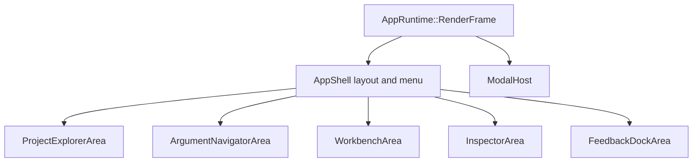
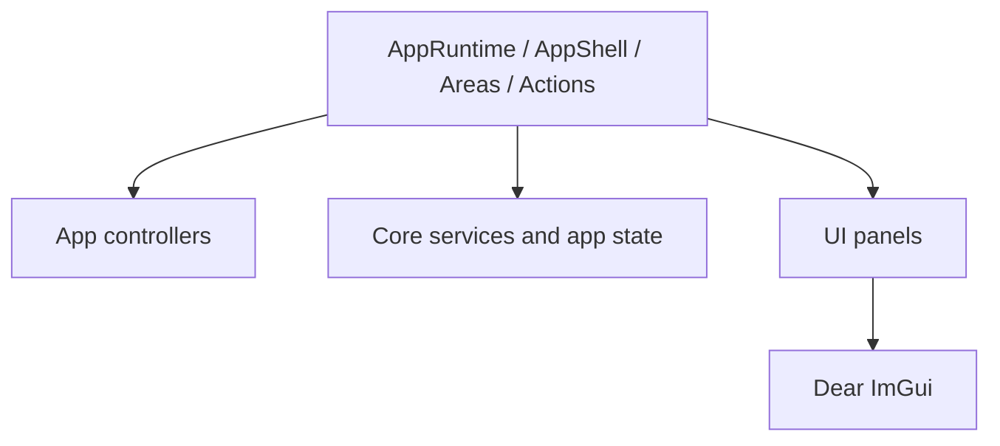

# App Shell and UI Areas

Assurance Forge uses a named application shell to keep the frame layout separate from feature-specific UI rendering. `RenderAppShell()` owns splitter handling and returns layout regions for the major application areas. The current implementation still routes area rendering through `AppRuntime`, but new code should use the names in this document when discussing or extracting the main application areas.

## Named Areas

| Area | Responsibility |
| --- | --- |
| `AppShell` | Persistent outer frame, main menu, future toolbar, splitters, and layout region calculation. |
| `ProjectExplorerArea` | Project files, SACM package nodes, registers, proposal patch files, and project-level navigation. |
| `ArgumentNavigatorArea` | Safety case tree navigation and tree editing commands. |
| `WorkbenchArea` | Main editable/viewing surface, including the GSN canvas, register views, package details, and terminology package view. |
| `InspectorArea` | Right-side details and selected element editing. |
| `FeedbackDockArea` | Problems, terminology usages, review items, and AI debug feedback. |
| `ModalHost` | Modal dialogs and popup workflows. |

Position-based names such as left panel, right panel, and bottom panel should be limited to temporary layout calculations. Long-lived code should use responsibility-based area names so the code remains meaningful if the layout changes later.

## Current Frame Shape

`AppRuntime` remains responsible for lifecycle coordination, event registration, derived view rebuilds, proposal preview refresh, AI task polling, and close/save-before-exit flow. Area renderers should focus on building panel models, wiring callbacks, and invoking lower-level UI panels.

`AppRuntimeState` keeps shared runtime data in responsibility-oriented groups where the ownership is stable: `layout` for splitter ratios and dock sizing, `workbench` for center-tab visibility and focus requests, `terminology` for terminology package/editor/usage UI state, and `ai` for AI service handles, settings, connection test state, and AI review coordination.

## Dependency Direction

Low-level UI panels in `src/ui/panels` should remain reusable ImGui views. They should not depend on `AppRuntime`. App-level areas and actions may depend on controllers, core services, app state, and UI panel APIs.

## Extraction Guidance

When extracting the current runtime code, prefer small behavior-preserving steps:

1. Rename existing render functions to the named area vocabulary.
2. Extract layout calculation and splitter handling into the frame layer.
3. Extract one area renderer at a time.
4. Move workflow-heavy callbacks into action classes or existing controllers.
5. Move modal dispatch behind `ModalHost`.

The refactor should not change SACM semantics, GSN rendering semantics, project file formats, terminology behavior, AI review behavior, proposal behavior, or persistence behavior.