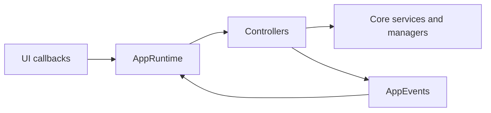
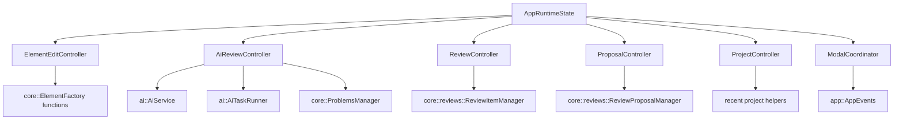
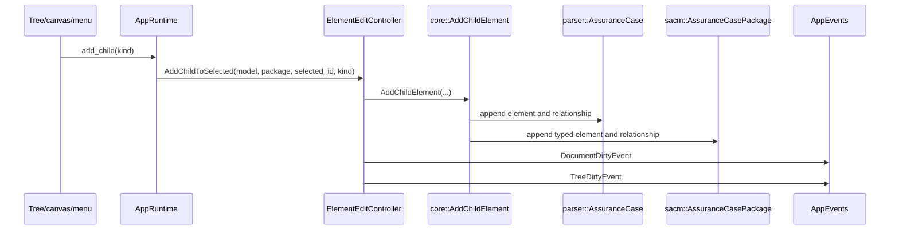
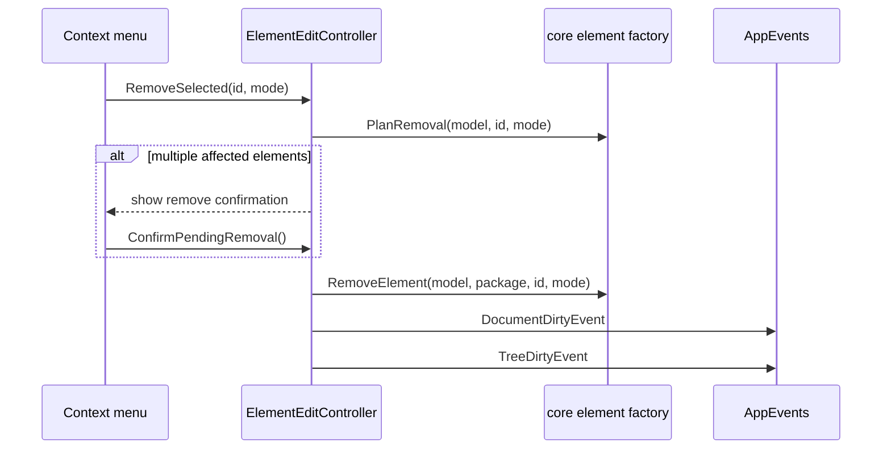
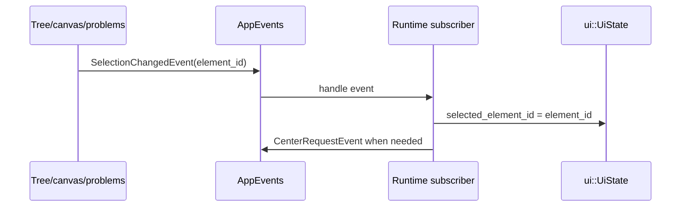
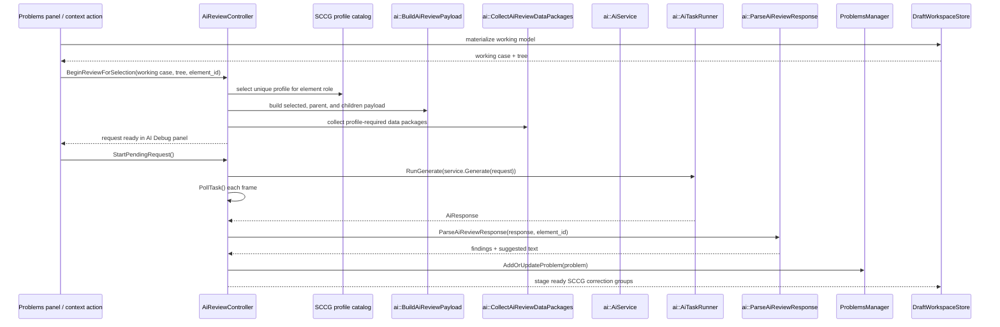

# Controllers

Controllers sit between ImGui callbacks and core services. They mutate state, coordinate storage, and emit `AppEvents`.

## Controller Reference

| Controller | Owns or coordinates | Main outputs |
| --- | --- | --- |
| `ElementEditController` | Add top goal, add child, remove selected, remove confirmation state. | `TreeDirtyEvent`, `DocumentDirtyEvent`, selection/status events. |
| `AiReviewController` | AI review request assembly, debug modal state, async task polling, response parsing. | AI `ProblemItem` records, status events. |
| `ReviewController` | Review item persistence, dirty state, delete/resolve workflow. | `ReviewItemsDirtyEvent`, review item file writes, and review-problem resync through AppRuntime. |
| `ProposalController` | Proposal manager, creator mode, preview model, generated id map. | Proposal draft/preview state. |
| `ProjectController` | File buffers, directory scan state, recent-project preferences, create/open modal state. | UI workflow state. |
| `ModalCoordinator` | Cross-cutting modal/window flags and close requests. | Modal visibility and close coordination. |

## Dependencies

## Add Element Flow

## Remove Element Flow

## Selection Flow

## AI Review Flow

Controllers should stay thin. Core rules belong in `src/core`, parser rules in `src/parser`, SACM round-trip rules in `src/legacy_sacm`, and provider-specific AI behavior in `src/ai`.

Two current exceptions are worth calling out:

- `ui::panels::ShowElementPanel()` edits the active parser element directly, then AppRuntime emits dirty events.
- `ReviewItemsDirtyEvent` is not storage-only. AppRuntime listens for it and rebuilds review-derived problems in `ProblemsManager`.
