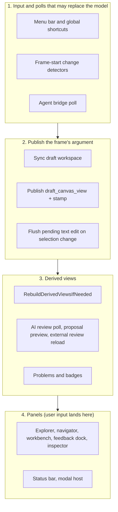

# Frame Ordering and Draft Views

Dear ImGui is immediate-mode: panels are rendered, and user input is processed,
inside the same frame callback that decides what to draw. That means state
legitimately changes *mid-frame* — a button click lands while the workbench is
already rendering, and a background AI task delivers its result inside the
frame's poll step. This page states the order of one frame, the contract that
keeps every surface consistent despite mid-frame changes, and the rules for
caches that sit on top of it.

[Runtime and State](runtime-state.md) covers the surrounding state ownership and
the event bus. The draft workspace's *semantics* — change groups, promotion, the
three view modes — are defined in the
[Integrated Draft Workspace plan](integrated-draft-workspace-plan.md) and
ADRs [0009](decisions/0009-one-integrated-working-draft-per-argument.md) and
[0010](decisions/0010-draft-provenance-persistence-and-human-promotion.md).

## One frame, in order

`AppRuntime::RenderFrame` (`src/app/app_runtime_frame.cpp`) runs these steps
every frame. The order is deliberate and load-bearing.

| Step | What happens | May mutate state? |
|---|---|---|
| Menu bar, shortcuts | Undo, theme, language toggles | Yes — before anything derived is built |
| Change detectors | Compare language epoch, canvas language, draft view mode and draft revision against last frame; set `tree_needs_rebuild` on change | Sets dirty flags only |
| Agent bridge poll | Runs connected-client requests against the live model | Yes — deliberately **before** the publish, so an agent switching files never leaves the frame drawing the previous document |
| **Publish** | `draft_canvas_view` is materialized once, with a stamp of the inputs it was built from | No |
| Text-edit flush | A selection change commits the previous element's in-progress edit | Yes — see [wrinkles](#known-wrinkles) |
| Derived views | `current_tree`, draft decorations, tree edit index, register views rebuilt if dirty | Derived state only |
| AI review poll | Completed reviews deliver findings; accepted suggestions are staged as draft groups | Yes — **after** the publish |
| Panels | ImGui rendering; clicks and edits are handled synchronously where the widget is rendered | Yes — throughout |
| Modal host | Deferred confirmations (rejection scope, file open) | Yes — last, so a teardown never invalidates what this frame is still drawing |

## The published draft view

While a draft workspace holds unaccepted changes, "the argument" is ambiguous:
there is the **accepted baseline** (the `.sacm` file), the **working model**
(baseline plus every active change group), and the canvas **view mode** that
chooses between them — or narrows to changes only.

The frame resolves this ambiguity exactly once. At the publish step,
`AppRuntimeState` receives:

| Field | Meaning |
|---|---|
| `draft_canvas_view` | The argument the canvas draws this frame. Materialized from the accepted case, the active draft groups, and the view mode. Null before the first frame. |
| `draft_canvas_view_case_revision` | `app_state.case_revision` at the moment the view was built |
| `draft_canvas_view_draft_revision` | `draft_workspace.revision()` at the moment the view was built |
| `draft_canvas_view_mode` | `ui::UiState::draft_view_mode` at the moment the view was built |
| `draft_frame_materialization` | Owns the materialized model for the whole frame, so an accept/discard clicked earlier in the frame cannot free storage later panels still point into |

Every UI area that shows "the argument on screen" reads `draft_canvas_view`.
Publishing once — rather than letting each area resolve the mode itself — is
what prevents one panel showing eighty staged elements while another shows
none.

## The contract

1. **Consumers read the published view, not the live stores.** A panel that
   re-derives "which argument is on screen" from live state can disagree with
   every other panel in the same frame.
2. **A cache whose content comes from the published view keys on the published
   stamp** (`draft_canvas_view_*`), never on the live `case_revision`,
   `draft_workspace.revision()`, or `ui::UiState::draft_view_mode`.
3. **A mutation after the publish becomes visible at the next frame's
   publish.** One frame at 60 Hz is imperceptible. Correct-one-frame-late is
   acceptable; wrong-until-the-next-change is not.

Rule 2 exists because breaking it produces a *latch*, not a delay. The failure
shape: a mode button click lands mid-frame, after the view was published. A
cache keyed on the *live* mode sees the new key, rebuilds — from the published
view, which was built with the *old* mode — and records the new key against the
old content. Next frame the key matches, so the correct view is never picked
up. The canvas is now one state change behind, permanently, and each further
click shows the *previous* selection's content. The same latch occurs when an
AI review completes in the poll step and stages draft groups: the revision
moves after the publish, the cache rebuilds this frame from the pre-draft view,
and the new revision is recorded against it.

Keyed on the published stamp instead, the cache keeps the old (matching)
content for the click frame and rebuilds one frame later from a view that
matches the key. Key and content always describe the same snapshot.

The argument-package canvas cache in `src/app/areas/workbench_area.cpp`
(`RenderArgumentPackageCanvasTab`) is the reference implementation of this
rule. Its change-set revision is read live, which is safe only because the
agent bridge — the sole change-set mutator — runs before the publish point. A
new mutation path for change sets later in the frame would require folding the
change-set revision into the published stamp as well.

## The staleness mechanisms

The runtime has four mechanisms that decide "something on screen is stale".
They overlap; this is what each is for.

| Mechanism | Trigger | Refreshes | Use for |
|---|---|---|---|
| `tree_needs_rebuild` + `RebuildDerivedViewsIfNeeded` | `TreeDirtyEvent`, model mutations | `current_tree`, draft decorations, edit index, register views, the shared canvas tree | Model mutations |
| Frame-start change detectors (static locals at the top of `RenderFrame`) | UI state that changes what should be drawn but is deliberately not a model mutation: language, canvas language, draft view mode, draft revision | Sets `tree_needs_rebuild` | UI-state changes with no event of their own |
| The per-frame publish (`draft_canvas_view` + stamp) | Every frame | Which argument is on screen | Anything that draws or projects the current argument |
| Per-tab caches (argument-package canvas) | Published stamp + package identity + language + change-set revision | That tab's projected case, tree, and renderer seed | Expensive per-tab projections |

For new code: content derived from the current argument keys on the published
stamp (mechanism 3 feeding mechanism 4). A new piece of UI state that should
repaint the canvas gets added to the stamp — or, failing that, a frame-start
detector — not a live read inside a cache key.

## Known wrinkles

- **The text-edit flush runs after the publish.** When a single click both
  leaves an edited field and selects another element, the pending edit is
  committed *after* `draft_canvas_view` was built. For that one frame the tree
  and inspector (rebuilt later in the frame) can be one edit ahead of the
  canvas. It self-heals at the next publish.
- **View-mode narrowing applies to the canvas only.** The argument navigator,
  register views, edit index and problems pipeline are always built from the
  whole working argument — selecting "changes only" must not make the rest of
  the application believe the safety case shrank to a handful of nodes. This is
  deliberate; the rationale lives at the rebuild site in
  `AppRuntime::RebuildDerivedViewsIfNeeded`.
- **The plain GSN canvas tab draws the shared tree.** The tab shown while a
  proposal canvas is active renders `current_tree` (the whole working
  argument); the per-package tabs are where the view-mode narrowing and the
  per-tab caches live.
