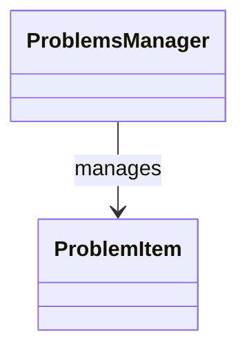

# Generated Class Diagrams

This page contains class diagrams generated from the C++ codebase.

Generated diagrams should be focused by subsystem. Avoid creating one large class diagram for the entire repository.

## Smoke-test diagram

## Planned generated diagrams

Planned subsystem diagrams:

- Core domain model
- Problem manager
- Review and proposal workflow
- SACM import/export
- UI panels