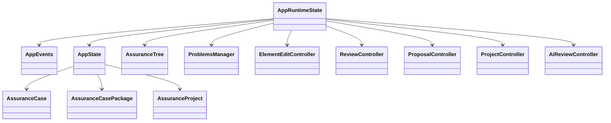

# Generated Class Diagrams

Class diagrams are generated from the C++ codebase by [`clang-uml`](https://github.com/bkryza/clang-uml). The generated files are written to `docs/diagrams/generated/` during the documentation workflow.

The diagrams are focused by subsystem. Do not generate a repository-wide class diagram.

## Generated Groups

| Diagram | Scope |
| --- | --- |
| `problem_system` | Problem item and problem manager. |
| `parser_sacm_tree` | Parser model, SACM domain model, and tree model. |
| `project_storage` | Project manifest, file entries, project load report, project service, and app state. |
| `controllers` | App event bus and controller layer. |
| `ui_panels` | Panel model/callback structs and panel entry points. |
| `review_ai` | Review items, proposals, proposal storage, AI service, AI task runner, and AI review payloads. |

## Core Relationships

This hand-authored diagram mirrors the generated groups and stays visible even before CI produces `.mmd` files.



## Problem System

```mermaid
--8<-- "docs/diagrams/generated/problem_system.mmd"
```

## Parser, SACM, And Tree

```mermaid
--8<-- "docs/diagrams/generated/parser_sacm_tree.mmd"
```

## Project Storage

```mermaid
--8<-- "docs/diagrams/generated/project_storage.mmd"
```

## Controllers

```mermaid
--8<-- "docs/diagrams/generated/controllers.mmd"
```

## UI Panels

```mermaid
--8<-- "docs/diagrams/generated/ui_panels.mmd"
```

## Review And AI

```mermaid
--8<-- "docs/diagrams/generated/review_ai.mmd"
```

## Generation Commands

```powershell
cmake -S . -B build-docs -G Ninja -DCMAKE_EXPORT_COMPILE_COMMANDS=ON -DHELLOIMGUI_DOWNLOAD_GLFW_IF_NEEDED=ON
clang-uml -g mermaid
```

Generated output appears under:

```text
docs/diagrams/generated/
```