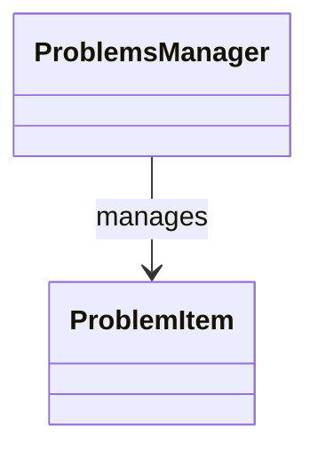

# Generated Class Diagrams

Class diagrams on this page are generated from the C++ codebase by [`clang-uml`](https://github.com/bkryza/clang-uml) and injected automatically whenever `main` is deployed to GitHub Pages. Diagrams are kept focused by subsystem rather than spanning the whole repository.

## Smoke-test placeholder

The diagram below is a hand-written placeholder used to verify that Mermaid rendering is working. It will be replaced by an auto-generated diagram once the CI pipeline produces output for the `problem_system` subsystem.

## Planned subsystem diagrams

The following subsystems are queued for diagram generation in `.clang-uml`:

- Problem manager (`problem_system`)
- Review and proposal workflow
- SACM import/export
- Core domain model
- UI panels