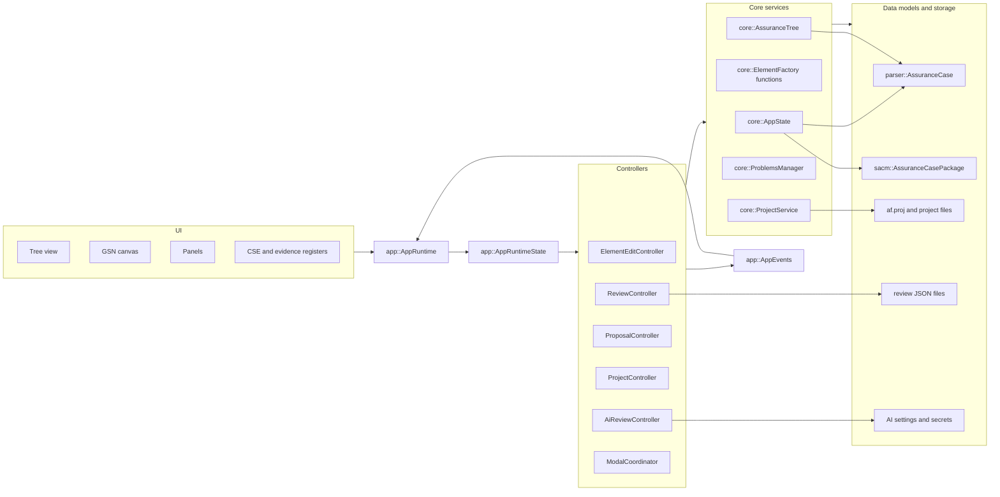

# Architecture

Assurance Forge is a C++ Dear ImGui desktop application for loading, editing, reviewing, and saving SACM assurance cases.

!!! tip "Why is it built this way?"
    The pages in this section describe the *current* component layout and data
    flow. For the *reasoning* behind the major architectural choices — and the
    trade-offs accepted — see the [Architecture Decision Records](decisions/index.md).

The application keeps three model shapes in use:

| Model | Owner | Purpose |
| --- | --- | --- |
| Parser model | `parser::AssuranceCase` | Flat list used by UI, tree building, registers, and review logic. |
| SACM domain model | `sacm::AssuranceCasePackage` | Typed SACM 2.3 subset used for save and round-trip behavior. |
| Tree model | `core::AssuranceTree` | Derived hierarchy used by the tree view and GSN canvas. |

## Subsystems

| Area | Main files | Notes |
| --- | --- | --- |
| Runtime | `src/app/app_runtime.*`, `src/app/app_runtime_state.h` | Owns frame rendering, controller wiring, dirty flags, and derived views. |
| Events | `src/app/app_events.h` | Typed in-process pub-sub for selection, dirty state, modals, proposals, and center-view requests. |
| Parser and SACM | `src/parser/xml_parser.*`, `src/sacm/*`, `src/core/assurance_tree.*` | XML is parsed into both a flat UI model and a typed SACM package. |
| Project storage | `src/core/project_model.h`, `src/core/project_service.*` | Project manifest, tracked files, hashes, file state, review files, and project directory layout. |
| Editing | `src/core/element_factory.*`, `src/app/controllers/element_edit_controller.*`, `src/ui/panels/element_panel.*` | Add/remove operations update parser and SACM models together. Text edits sync back into SACM. |
| UI | `src/ui/tree_view.*`, `src/ui/gsn/*`, `src/ui/panels/*`, `src/ui/register_views.*` | Panels render ImGui only and call runtime/controller callbacks. |
| Review and AI | `src/core/reviews/*`, `src/core/problems/*`, `src/ai/*`, `src/app/controllers/ai_review_controller.*` | Review items, proposed patches, problems, guideline context, AI task execution. |

## Update Rules

- Parser model changes must be mirrored into the SACM package before save.
- `core::AssuranceTree` is derived data. Rebuild it after model changes instead of mutating it directly.
- Panels should communicate through callbacks and `AppEvents`; business rules belong in controllers or core services.
- Project file state belongs in `core::AssuranceProject` and is persisted through `core::ProjectService`.