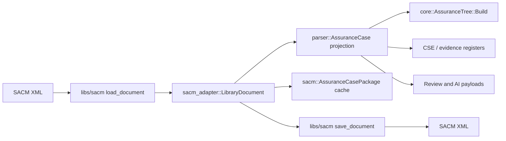
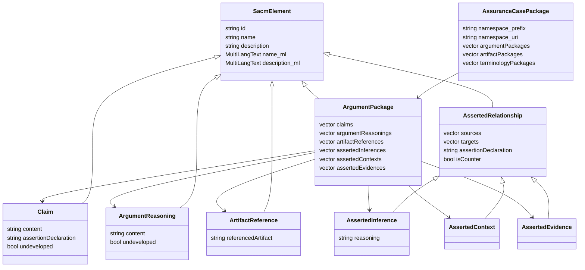
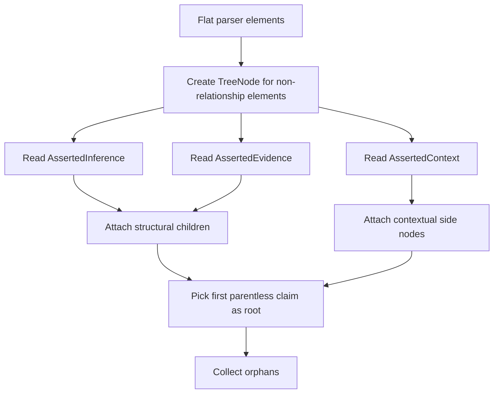
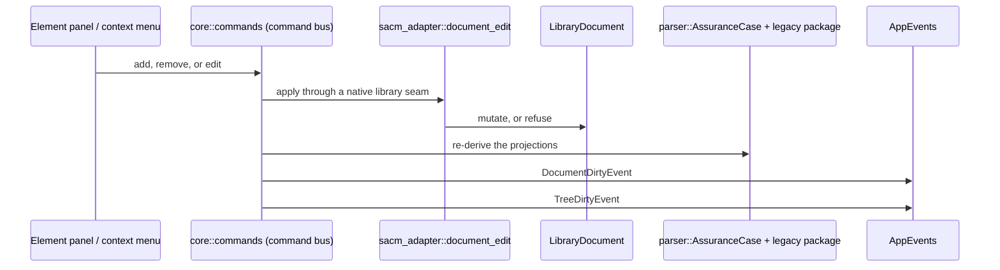

# Parser and SACM

SACM XML is loaded by the **`libs/sacm` library**, which owns the document.
Everything else on this page is derived from it.

| Model | Shape | Owns | Used by |
| --- | --- | --- | --- |
| `sacm_adapter::LibraryDocument` | The `libs/sacm` SACM 2.3 document, including content no application struct models | **The source of truth.** Load, edit and save | Command seams, save, round-trip |
| `parser::AssuranceCase` | Flat list of `parser::SacmElement` records; relationship elements sit beside node elements | Nothing — projected from the document | UI panels, GSN tree, registers, review logic |
| `sacm::AssuranceCasePackage` (`src/legacy_sacm`) | Typed legacy package with argument, artifact and terminology containers | Nothing — a derived cache | Some editing paths and terminology display, being retired |

!!! warning "The legacy package is not the save source"
    It was, and much of the detail below still describes it. `AppState::save_file`
    serializes the **library document**; the legacy package is a fallback used only
    when that fails, and because it can only model what the application renders,
    that fallback drops unknown and vendor-namespace content — so it reports itself
    in the status bar rather than saving silently.

## Parser Model

`parser::AssuranceCase` stores case metadata and `elements`.

`parser::SacmElement` stores:

| Field group | Fields |
| --- | --- |
| Identity | `id`, `name`, `type`, `description`, `content`, `undeveloped`. |
| Language maps | `name_langs`, `description_langs`, `content_langs`. |
| Relationship refs | `source_refs`, `target_refs`, `reasoning_ref`, `assertion_declaration`. |

The parser model is intentionally flat. A claim, strategy, evidence item, asserted inference, asserted context, and asserted evidence relationship can all appear as entries in the same vector.

## SACM Domain Model

`sacm::AssuranceCasePackage` owns:

| Container | Contents |
| --- | --- |
| `terminologyPackages` | `TerminologyPackage` and `Expression`. |
| `artifactPackages` | `ArtifactPackage` and `Artifact`. |
| `argumentPackages` | Argument elements and relationships. |

`sacm::ArgumentPackage` owns:

| Collection | Meaning |
| --- | --- |
| `claims` | Assertions and GSN goals/assumptions/justifications. |
| `argumentReasonings` | Strategies. |
| `artifactReferences` | Context and evidence references. |
| `assertedInferences` | Support relationships. |
| `assertedContexts` | Context relationships. |
| `assertedEvidences` | Evidence relationships. |

## Tree Model

`core::AssuranceTree` is derived from the parser model.

`core::TreeNode` fields used by the UI:

| Field | Meaning |
| --- | --- |
| `id` | Original SACM element id. |
| `label`, `label_secondary` | Primary and secondary display text. |
| `role` | Claim, Strategy, Solution, Context, Assumption, Justification, or Other. |
| `group` | `Group1` structural child or `Group2` contextual attachment. |
| `group1_children` | Child nodes rendered below the parent. |
| `group2_attachments` | Contextual nodes rendered beside the parent. |
| `parent` | Structural parent pointer. |

## Edit Synchronization

Every audited edit goes through a library seam. A shape no seam expresses is
**refused with the tracked file byte-unchanged** rather than rebuilt from a
projection — the legacy compatibility bridge that used to carry such edits is
deleted (`AF-STD-011`).

The element panel still calls `sync_to_sacm()` after a text edit. That keeps the
derived legacy package consistent with an edit that did not route through a
library operation; it is not what the save reads.