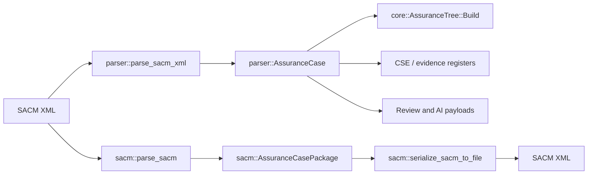
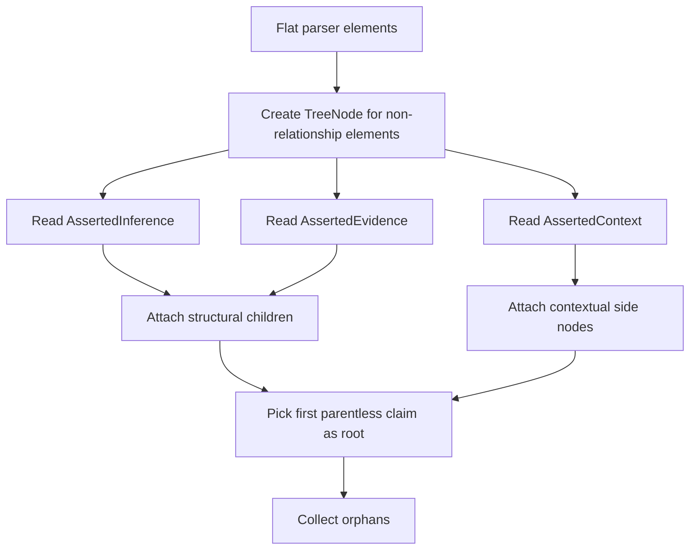
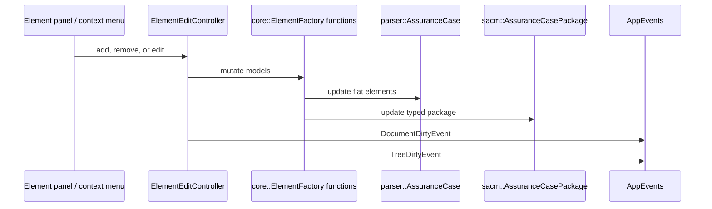

# Parser and SACM

Assurance Forge loads SACM XML into two synchronized models.

| Model | Shape | Used by |
| --- | --- | --- |
| `parser::AssuranceCase` | Flat list of `parser::SacmElement` records. Relationship elements are stored beside node elements. | UI panels, GSN tree, registers, review logic. |
| `sacm::AssuranceCasePackage` | Typed SACM package with argument, artifact, and terminology containers. | Save and round-trip behavior. |

## Parser Model

`parser::AssuranceCase` stores case metadata and `elements`.

`parser::SacmElement` stores:

| Field group | Fields |
| --- | --- |
| Identity | `id`, `name`, `type`, `description`, `content`, `undeveloped`. |
| Language maps | `name_langs`, `description_langs`, `content_langs`. |
| Relationship refs | `source_refs`, `target_refs`, `reasoning_ref`, `assertion_declaration`. |

The parser model is intentionally flat. A claim, strategy, evidence item, asserted inference, asserted context, and asserted evidence relationship can all appear as entries in the same vector.

## SACM Domain Model

`sacm::AssuranceCasePackage` owns:

| Container | Contents |
| --- | --- |
| `terminologyPackages` | `TerminologyPackage` and `Expression`. |
| `artifactPackages` | `ArtifactPackage` and `Artifact`. |
| `argumentPackages` | Argument elements and relationships. |

`sacm::ArgumentPackage` owns:

| Collection | Meaning |
| --- | --- |
| `claims` | Assertions and GSN goals/contexts/assumptions/justifications. |
| `argumentReasonings` | Strategies. |
| `artifactReferences` | Evidence references. |
| `assertedInferences` | Support relationships. |
| `assertedContexts` | Context relationships. |
| `assertedEvidences` | Evidence relationships. |

## Tree Model

`core::AssuranceTree` is derived from the parser model.

`core::TreeNode` fields used by the UI:

| Field | Meaning |
| --- | --- |
| `id` | Original SACM element id. |
| `label`, `label_secondary` | Primary and secondary display text. |
| `role` | Claim, Strategy, Solution, Context, Assumption, Justification, or Other. |
| `group` | `Group1` structural child or `Group2` contextual attachment. |
| `group1_children` | Child nodes rendered below the parent. |
| `group2_attachments` | Contextual nodes rendered beside the parent. |
| `parent` | Structural parent pointer. |

## Edit Synchronization

Text edits in the element panel update the selected parser element and call `sync_to_sacm()` so the SACM package remains the save source.