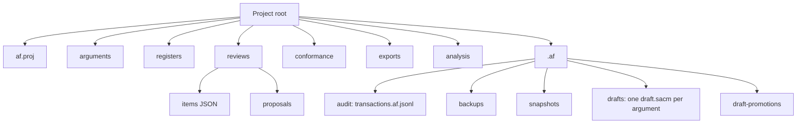
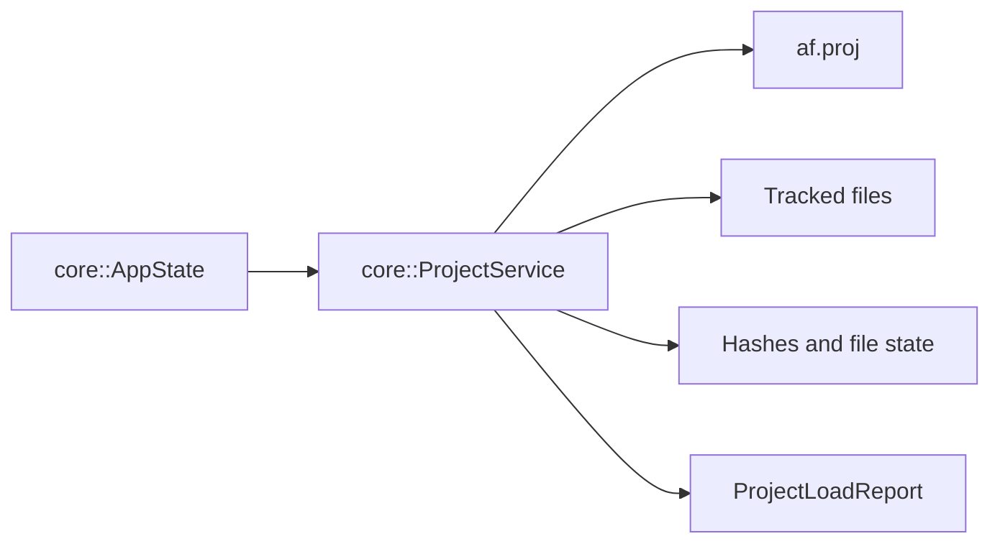
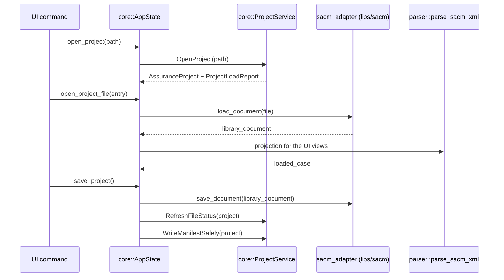

# Project Storage

An Assurance Forge project is a directory with an `af.proj` JSON manifest and tracked files.

`.af/` is runtime state, not assurance data: the audit log, backups, snapshots,
and the working drafts (each a SACM document of its own —
[ADR 0016](decisions/0016-the-draft-is-a-sacm-document.md)). The project service
writes a `.gitignore` into it on open, so a project under version control does
not carry it. Deleting `.af/` loses history, not argument.

## Manifest Model

`core::AssuranceProject` is the in-memory manifest.

| Field | Meaning |
| --- | --- |
| `id`, `name`, `description` | Project identity. |
| `formatVersion` | Manifest schema version. |
| `createdUtc`, `modifiedUtc` | Project timestamps. |
| `defaultLanguage` | Default language for project content. |
| `validationMode` | Validation strictness. |
| `rootPath` | Project directory. |
| `files` | Tracked files and their current state. |

`core::ProjectFileEntry` tracks each file.

| Field | Meaning |
| --- | --- |
| `id` | Stable tracked-file id. |
| `relativePath` | Path from the project root. |
| `role` | SACM argument, evidence register, J3377/CAE register, register assessments, review items, review proposal, confidence assessments, conformance sheet, exported report, or unknown. |
| `state` | Clean, modified, missing, moved, parse error, unsupported version, or generated outdated. |
| `rawHash` | SHA-256 of raw file bytes. |
| `semanticHash` | Content hash independent of formatting where supported. |
| `elementIndexHash` | Hash for element identity/index changes. |
| `relationshipGraphHash` | Hash for graph relationship changes. |
| `parseStatus`, `lastError` | Last parse or validation result. |

## Project Service

`core::ProjectService` owns manifest and tracked-file operations.

| Operation | Effect |
| --- | --- |
| `CreateEmptyProject` | Creates directory layout and initial manifest. |
| `OpenProject` | Reads `af.proj`, scans files, and returns a load report. |
| `AddSacmFile` | Adds a SACM argument file to the project. |
| `AddEvidenceRegister` | Adds an evidence register. |
| `AddJ3377CaeRegister` | Adds a conformance register. |
| `AddReviewItemsFile` | Adds review item storage. |
| `SaveReviewItemsFile` | Writes review item JSON and tracks it. |
| `AddReviewProposalFile` / `SaveReviewProposalFile` | Writes proposal JSON under reviews/proposals. |
| `RemoveTrackedFile` | Removes a manifest entry and optionally deletes the file. |
| `WriteManifestSafely` | Writes `af.proj`. |
| `RefreshFileStatus` | Recomputes state and hashes for tracked files. |

## Open and Save Flow

**The save writes the library document, not the projection.** The UI reads a
projection of the SACM model, but nothing is written back from it — an edit the
library has no seam for is refused with the file byte-unchanged rather than
reconstructed from what the UI happened to be showing
([ADR 0003](decisions/0003-sacm-xml-as-source-of-truth.md), `AF-STD-001`,
`AF-STD-011`).

## File Roles

| Role | Stored data |
| --- | --- |
| `SacmArgument` | SACM XML argument model. |
| `EvidenceRegister` | Evidence register data. |
| `J3377CaeRegister` | J3377/CAE conformance register data. |
| `RegisterAssessments` | The legacy project-wide store of register assessments, keyed by CSE / evidence id. New assessments are written into the SACM document instead; this is read, reported and migrated. |
| `ConfidenceAssessments` | Confidence assessments (`analysis/confidence.af.json`), each carrying a fingerprint of the element it judges so a stale assessment is reported rather than trusted. |
| `ReviewItems` | Review item JSON. |
| `ReviewProposal` | Individual review proposal JSON. |
| `ConformanceSheet` | Conformance artifacts. |
| `ExportedReport` | Generated reports. |
| `Unknown` | Tracked but not classified. |

Project state is independent of the active UI selection. Opening a project loads the manifest; opening a project file loads a specific SACM model.