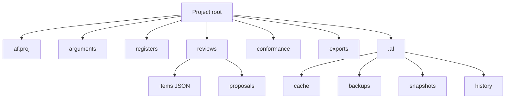
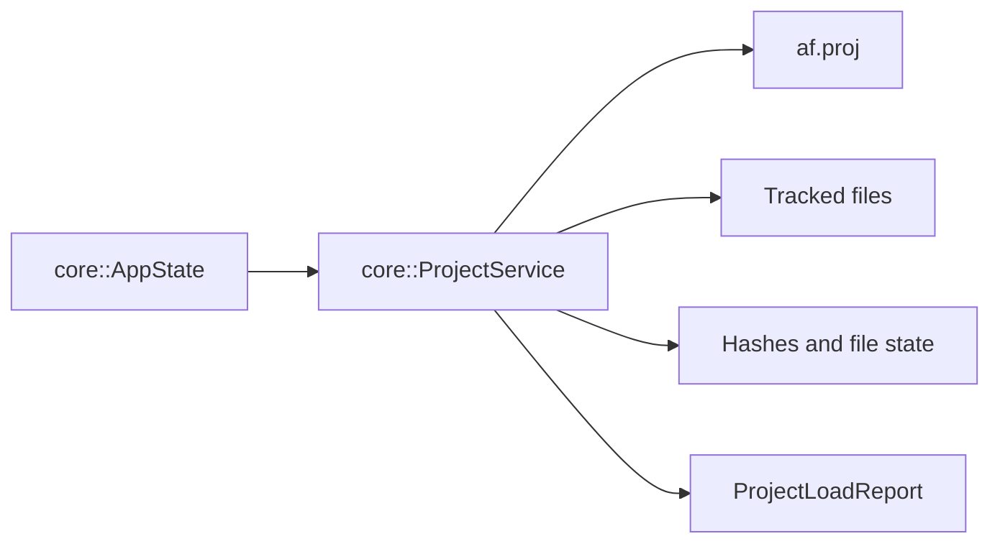
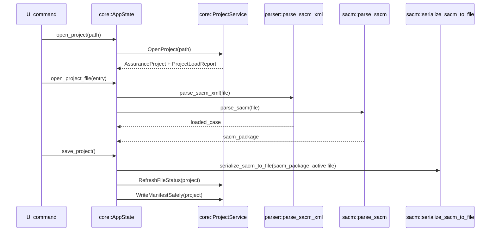

# Project Storage

An Assurance Forge project is a directory with an `af.proj` JSON manifest and tracked files.

## Manifest Model

`core::AssuranceProject` is the in-memory manifest.

| Field | Meaning |
| --- | --- |
| `id`, `name`, `description` | Project identity. |
| `formatVersion` | Manifest schema version. |
| `createdUtc`, `modifiedUtc` | Project timestamps. |
| `defaultLanguage` | Default language for project content. |
| `validationMode` | Validation strictness. |
| `rootPath` | Project directory. |
| `files` | Tracked files and their current state. |

`core::ProjectFileEntry` tracks each file.

| Field | Meaning |
| --- | --- |
| `id` | Stable tracked-file id. |
| `relativePath` | Path from the project root. |
| `role` | SACM argument, evidence register, review items, review proposal, conformance sheet, exported report, or unknown. |
| `state` | Clean, modified, missing, moved, parse error, unsupported version, or generated outdated. |
| `rawHash` | SHA-256 of raw file bytes. |
| `semanticHash` | Content hash independent of formatting where supported. |
| `elementIndexHash` | Hash for element identity/index changes. |
| `relationshipGraphHash` | Hash for graph relationship changes. |
| `parseStatus`, `lastError` | Last parse or validation result. |

## Project Service

`core::ProjectService` owns manifest and tracked-file operations.

| Operation | Effect |
| --- | --- |
| `CreateEmptyProject` | Creates directory layout and initial manifest. |
| `OpenProject` | Reads `af.proj`, scans files, and returns a load report. |
| `AddSacmFile` | Adds a SACM argument file to the project. |
| `AddEvidenceRegister` | Adds an evidence register. |
| `AddJ3377CaeRegister` | Adds a conformance register. |
| `AddReviewItemsFile` | Adds review item storage. |
| `SaveReviewItemsFile` | Writes review item JSON and tracks it. |
| `AddReviewProposalFile` / `SaveReviewProposalFile` | Writes proposal JSON under reviews/proposals. |
| `RemoveTrackedFile` | Removes a manifest entry and optionally deletes the file. |
| `WriteManifestSafely` | Writes `af.proj`. |
| `RefreshFileStatus` | Recomputes state and hashes for tracked files. |

## Open and Save Flow

## File Roles

| Role | Stored data |
| --- | --- |
| `SacmArgument` | SACM XML argument model. |
| `EvidenceRegister` | Evidence register data. |
| `J3377CaeRegister` | J3377/CAE conformance register data. |
| `ReviewItems` | Review item JSON. |
| `ReviewProposal` | Individual review proposal JSON. |
| `ConformanceSheet` | Conformance artifacts. |
| `ExportedReport` | Generated reports. |
| `Unknown` | Tracked but not classified. |

Project state is independent of the active UI selection. Opening a project loads the manifest; opening a project file loads a specific SACM model.