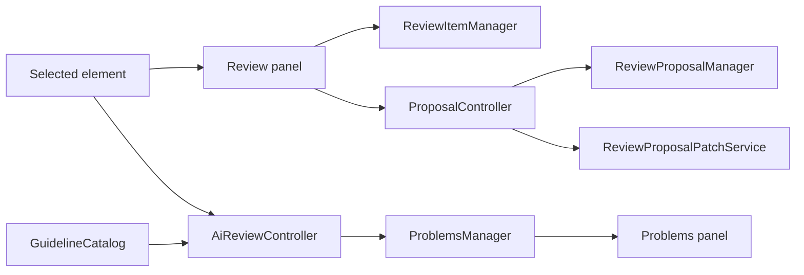
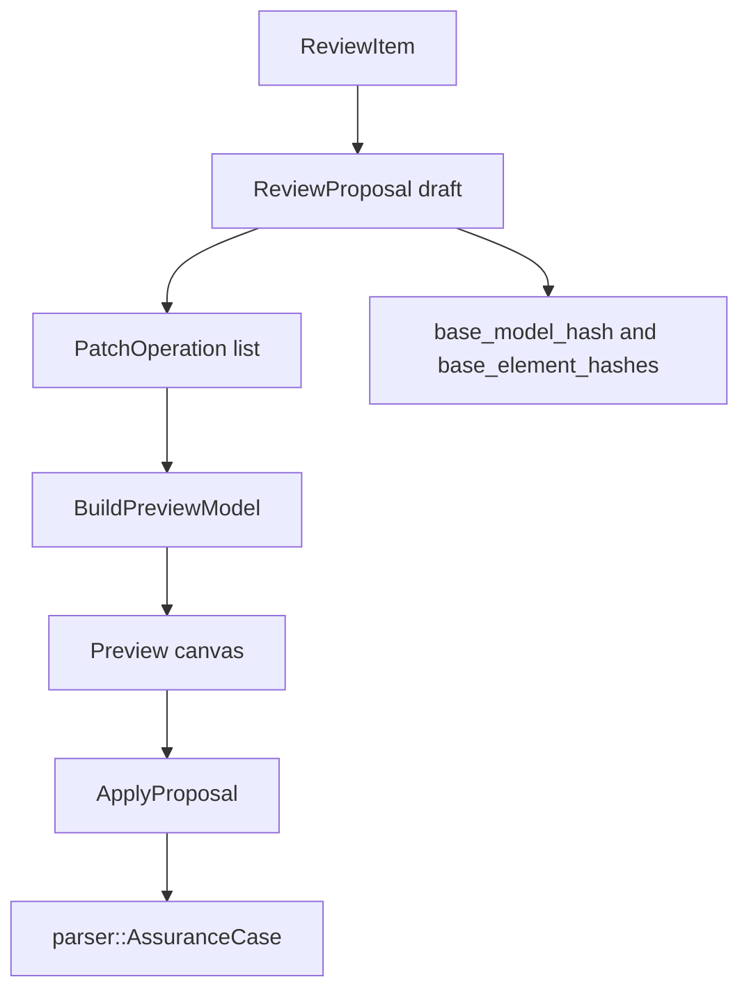
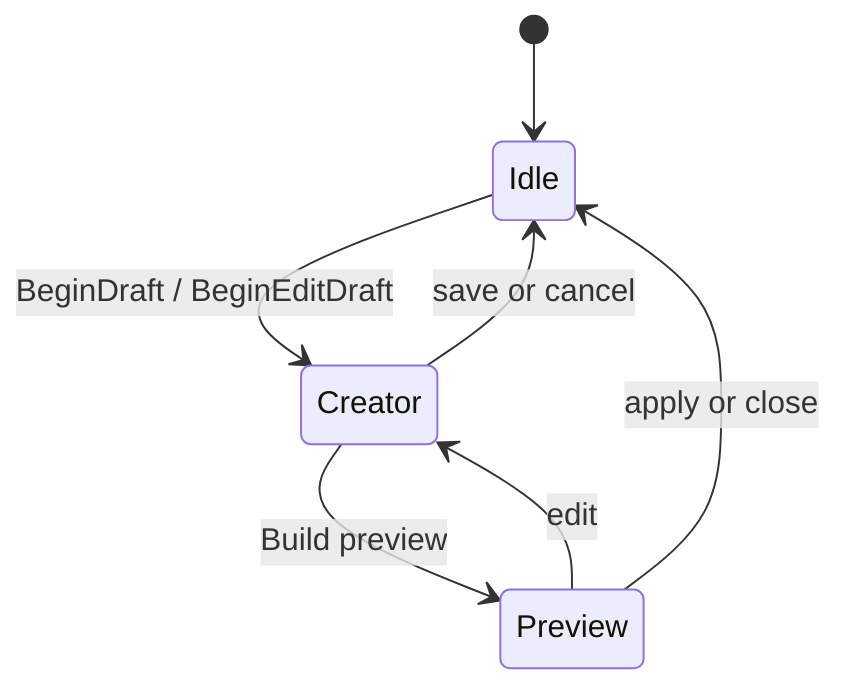
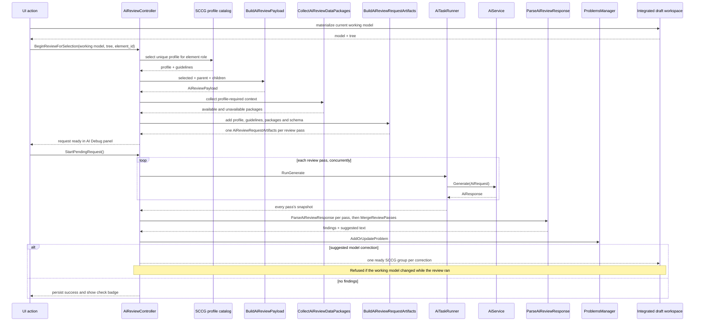
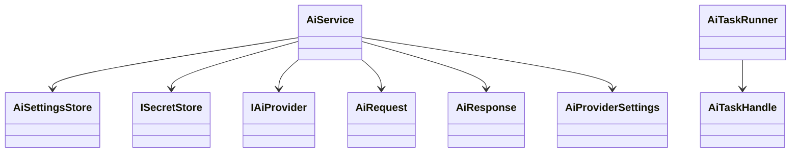

# Review and AI

Review, proposals, problems, guidelines, and AI review share the selected assurance case but use separate storage and service types.

## Problems

`core::ProblemsManager` stores `core::ProblemItem` values.

| Field | Meaning |
| --- | --- |
| `id` | Problem id. |
| `severity` | Info, warning, or error. |
| `source` | Manual, review comment, model validation, guideline review, AI review, or import/export. |
| `element_id` | Related SACM element. |
| `type` | Problem category. |
| `message` | User-facing message. |
| `guideline_id` | Optional guideline reference. |

The problems panel activates a problem by selecting its element and requesting focus in the center view.

## Review Items

`core::reviews::ReviewItem` is a comment or finding attached to an element.

| Field | Meaning |
| --- | --- |
| `element_id` | Element under review. |
| `title`, `message`, `severity` | Review content. |
| `reviewer_name` | Author. |
| `guideline_ids` | Related SCCG guidelines. |
| `source` | Manual or AI review. |
| `status` | Open or resolved. |
| `proposal_id` | Optional linked change proposal. |

`ReviewController` wraps `ReviewItemManager`, tracks dirty state, and saves review items through project storage.

When review items change, `ReviewItemsDirtyEvent` causes AppRuntime to call `SyncReviewProblems()`, which converts open review items into `ReviewComment` and `GuidelineReview` problem entries in `ProblemsManager`.

## Review Proposals

`core::reviews::ReviewProposal` stores structured patch operations.

Patch operations include create claim/strategy/solution/context/assumption/justification, update text/name, set or clear undeveloped, add/remove support, add/remove context, and remove element.

Validity is checked with:

| Function | Purpose |
| --- | --- |
| `ComputeModelSemanticHash` | Fingerprint the base model. |
| `ComputeElementSemanticHash` | Fingerprint affected elements. |
| `EvaluateReviewProposalValidity` | Detect whether the proposal still applies to the current model. |

## Proposal Modes

`ProposalController` keeps creator/preview flags, the preview parser model, the active draft, and generated id mappings for created elements.

## AI Review

AI review builds a request from the selected element and the data packages required
by its SCCG review profile. When an integrated draft is active, the request uses
the complete materialized working model, including changes contributed by MCP,
the user, and earlier SCCG review groups. The request preview explicitly says
that it includes unaccepted draft content.

The review method itself — profile selection, payload and data-package
construction, prompt and result contracts, response parsing and validation —
lives in `src/review` (`review::`), separated from the provider calls in
`src/ai` by
[ADR 0013](decisions/0013-review-methods-independent-of-inference-providers.md).
`AiReviewController` composes the two.

The UI exposes one `AI Review` action. The controller maps the selected SACM
element to the SCCG **element role** it plays — claim, strategy, evidence,
context, assumption, justification, challenge — and selects the one profile
whose selected-element data package carries that role, refusing to run if the
catalog has no match or an ambiguous match. `element_role` is the key SCCG
publishes for a tool whose own model is neither GSN nor CAE, and the same key
names the package the element travels in, so the profile chosen and the package
sent cannot disagree. A no-findings result is persisted in the element review state
and rendered as a green check badge on the GSN node, so completion remains visible
after the spinner stops and after the project is reopened.

Steps one to five of that — resolve the element, select the profile, collect
the data packages, run the pre-checks, assemble the request — are
`review::PrepareSccgReview`, so the application and the offline evaluation
harness (`af-sccg-review-eval`) build the same request from the same code.

**Review passes.** Where a profile publishes `review_passes` (SCCG 0.8.0's
`claim_review` has four: wording, structure, sufficiency, reasoning), the review
is sent as one request per pass, concurrently, each carrying only that pass's
guidelines and the same data packages, and the answers are merged under the one
profile by `review::MergeReviewPasses`. Profile selection is unchanged. The
reason is measured: a review files a correctly detected defect under a
neighbouring guideline when the two arrive in the same request, and splitting
`claim_review` took 31 probes from 18 to 26 cited as intended. A finding a pass
cites under a guideline another pass owns is discarded and reported; a pass that
fails makes the review *incomplete* — the other passes' findings are recorded,
an "AI review incomplete" item names the failed pass, and the outcome is failed,
so an incomplete review can never earn the no-findings badge. The AI Debug panel
shows every pass's prompt under a separator line; an edit that keeps the
separators goes back to its pass, one that removes them is sent as a single
request, and the user is told.

**Unavailable data packages** are governed by SCCG's `when_unavailable` rule,
sent to the model verbatim with SCCG's meaning for each availability state: an
unavailable package never silences a guideline and is never by itself a finding.
A profile's `when_absent` entry is the only exception (none is published in
0.8.0). A package with no required fields counts as available only when one of
its published fields is populated, so every package the collector builds uses
SCCG's published field names — a conformance test holds that.

## AI Service Stack

Settings are persisted as JSON. API keys go through `ISecretStore`; on Windows the implementation uses Credential Manager.
