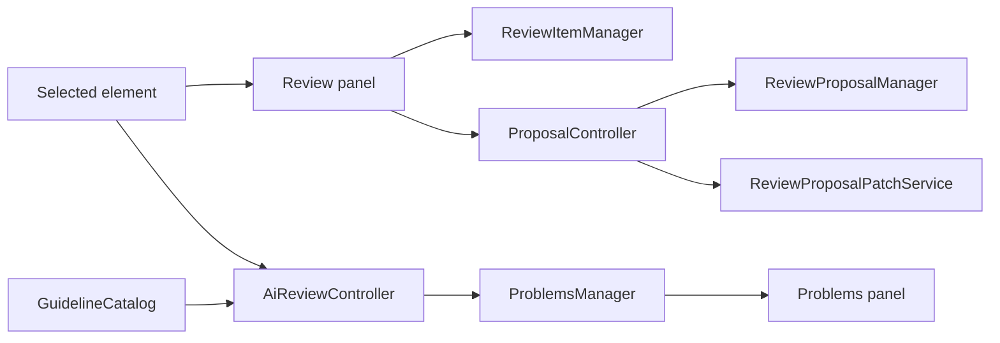
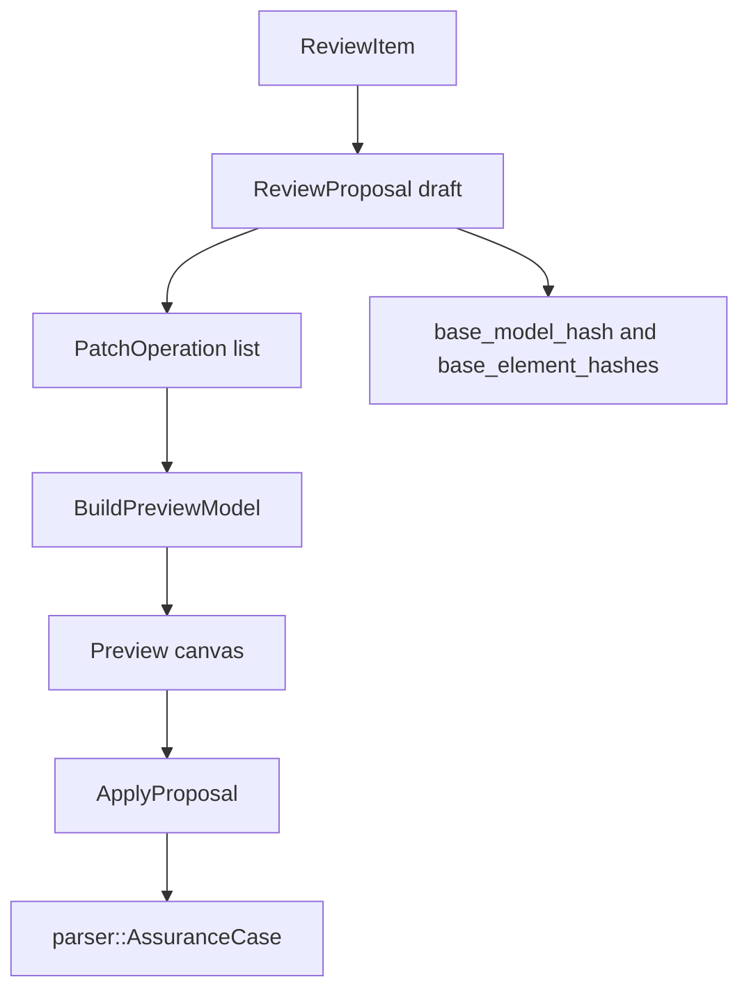
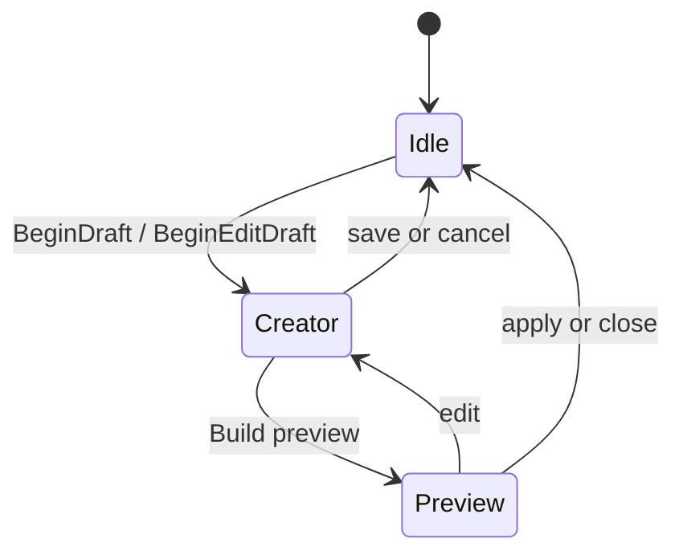
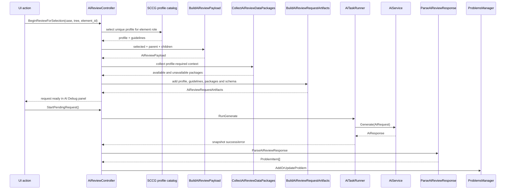
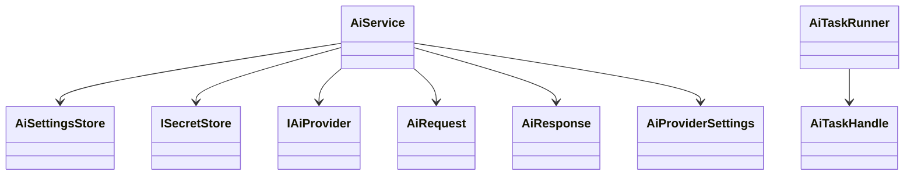

# Review and AI

Review, proposals, problems, guidelines, and AI review share the selected assurance case but use separate storage and service types.

## Problems

`core::ProblemsManager` stores `core::ProblemItem` values.

| Field | Meaning |
| --- | --- |
| `id` | Problem id. |
| `severity` | Info, warning, or error. |
| `source` | Manual, review comment, model validation, guideline review, AI review, or import/export. |
| `element_id` | Related SACM element. |
| `type` | Problem category. |
| `message` | User-facing message. |
| `guideline_id` | Optional guideline reference. |

The problems panel activates a problem by selecting its element and requesting focus in the center view.

## Review Items

`core::reviews::ReviewItem` is a comment or finding attached to an element.

| Field | Meaning |
| --- | --- |
| `element_id` | Element under review. |
| `title`, `message`, `severity` | Review content. |
| `reviewer_name` | Author. |
| `guideline_ids` | Related SCCG guidelines. |
| `source` | Manual or AI review. |
| `status` | Open or resolved. |
| `proposal_id` | Optional linked change proposal. |

`ReviewController` wraps `ReviewItemManager`, tracks dirty state, and saves review items through project storage.

When review items change, `ReviewItemsDirtyEvent` causes AppRuntime to call `SyncReviewProblems()`, which converts open review items into `ReviewComment` and `GuidelineReview` problem entries in `ProblemsManager`.

## Review Proposals

`core::reviews::ReviewProposal` stores structured patch operations.

Patch operations include create claim/strategy/solution/context/assumption/justification, update text/name, set or clear undeveloped, add/remove support, add/remove context, and remove element.

Validity is checked with:

| Function | Purpose |
| --- | --- |
| `ComputeModelSemanticHash` | Fingerprint the base model. |
| `ComputeElementSemanticHash` | Fingerprint affected elements. |
| `EvaluateReviewProposalValidity` | Detect whether the proposal still applies to the current model. |

## Proposal Modes

`ProposalController` keeps creator/preview flags, the preview parser model, the active draft, and generated id mappings for created elements.

## AI Review

AI review builds a request from the selected element and the data packages required
by its SCCG review profile. The UI exposes one `AI Review` action. The controller
maps the selected GSN role to exactly one SCCG 0.6 profile and refuses to run if
the catalog has no match or an ambiguous match.

## AI Service Stack

Settings are persisted as JSON. API keys go through `ISecretStore`; on Windows the implementation uses Credential Manager.
