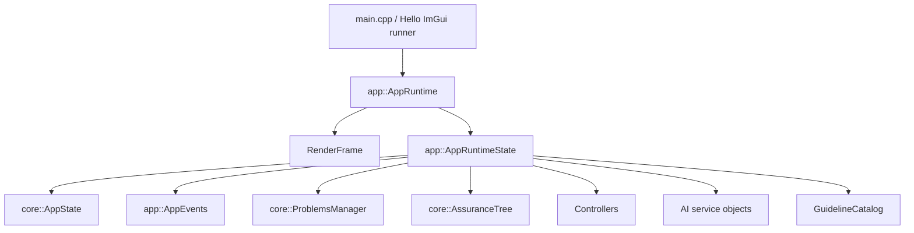
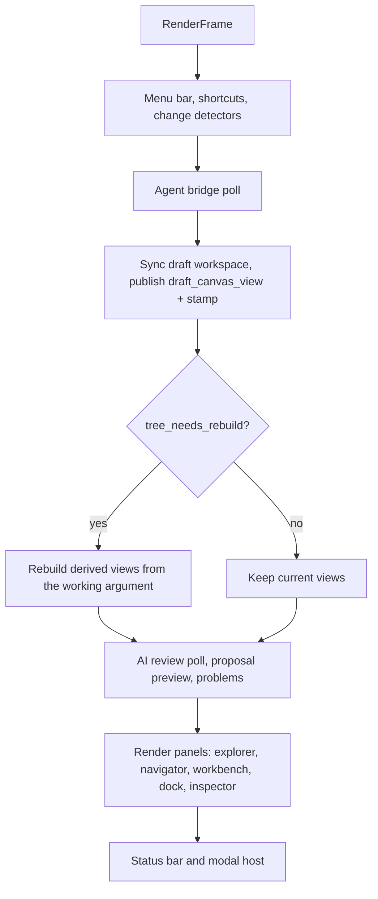
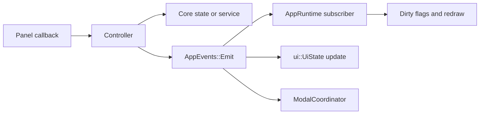
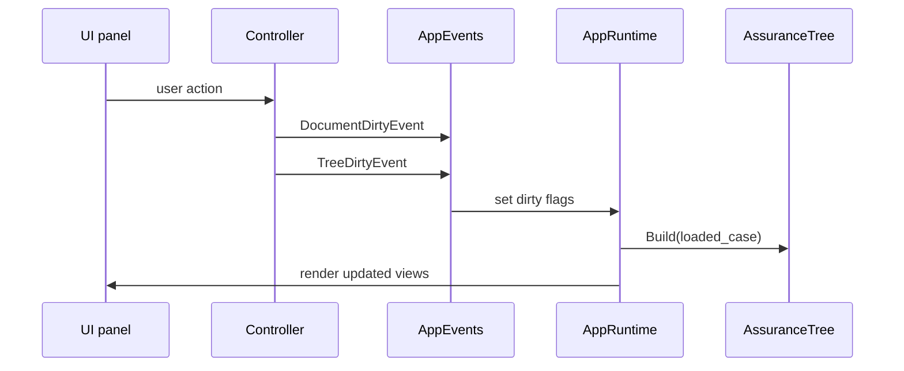

# Runtime and State

`app::AppRuntime` is the frame-level orchestrator. `app::AppRuntimeState` owns the long-lived state, controllers, services, derived tree, and UI layout values.

## Runtime State

| Field | Purpose |
| --- | --- |
| `app_state` | Loaded case, SACM package, active project, active file, dirty flag, status message. |
| `events` | Dispatches typed app events to subscribers. |
| `problems_manager` | Holds manual, validation, import/export, guideline, and AI problems. |
| `*_controller` | Orchestrates UI actions and core services. |
| `guideline_catalog` | SCCG guideline data used by review workflows and AI prompts. |
| `ai_*` | AI settings, secret storage, HTTP client, provider, service, and task runner. |
| `current_tree` | Derived hierarchy built from the working argument (accepted case plus active draft groups). |
| `tree_needs_rebuild` | Marks `current_tree` stale after model changes. |
| `draft_workspace` | The integrated working draft for the open argument: ordered change groups awaiting promotion (ADR 0009, 0010). |
| `draft_canvas_view` + stamp | The argument the canvas draws this frame, published once per frame together with the revisions and view mode it was built from. See [Frame Ordering and Draft Views](frame-and-draft-views.md). |
| layout ratios | Runtime layout sizes for side panels and bottom panel. These are not persisted in the current code. |

`core::AppState` owns the loaded data:

| Field | Purpose |
| --- | --- |
| `loaded_case` | Flat parser model for UI and derived views. |
| `sacm_package` | Typed SACM package used by save. |
| `current_project` | Open project manifest and tracked file state. |
| `active_project_file_path` | Active file inside a project. |
| `loaded_file_path` | Loaded standalone or project SACM file. |
| `has_unsaved_changes` | Document dirty state. |

## Frame Flow

The ordering within a frame is load-bearing: the agent bridge runs before the
draft view is published, the publish runs before any panel renders, and user
input mutates state mid-render — visible at the next frame's publish. The full
timeline, the published-view contract, and the rules for canvas caches are in
[Frame Ordering and Draft Views](frame-and-draft-views.md).

## Event Bus

`app::AppEvents` stores subscribers and dispatches `std::variant` events.

| Event | Meaning |
| --- | --- |
| `StatusMessageEvent` | Replace the status message shown by the app. |
| `TreeDirtyEvent` | Rebuild `current_tree` from the parser model. |
| `DocumentDirtyEvent` | Mark document state dirty. |
| `ReviewItemsDirtyEvent` | Mark review items dirty and resync review-derived problems into `ProblemsManager`. |
| `ProjectFilesChangedEvent` | Project manifest or tracked file state changed. |
| `ActiveModelChangedEvent` | A new model is loaded and derived views must refresh. |
| `SelectionChangedEvent` | Selected element changed. |
| `CenterRequestEvent` | Focus the GSN canvas or register tab. |
| `ProposalModeChangedEvent` | Proposal creator or preview mode changed. |
| `ProposalHighlightEvent` | Highlight or dim proposal-related nodes. |
| `ModalRequestEvent` | Open or close a modal/window. |

## Dirty State

Only the parser model and SACM package are durable editing state. Tree, GSN layout, register rows, proposal preview state, and layout ratios are derived or runtime-only.