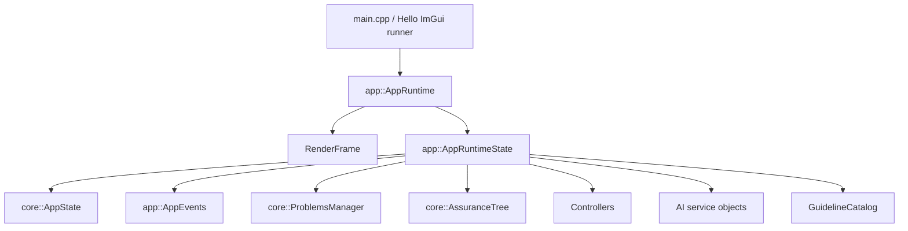
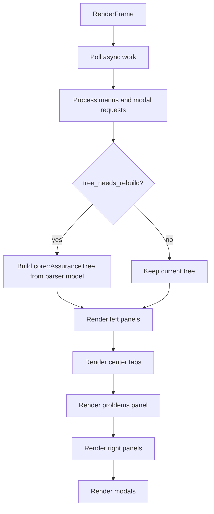
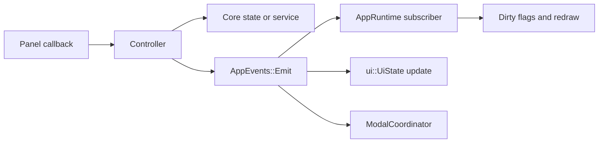
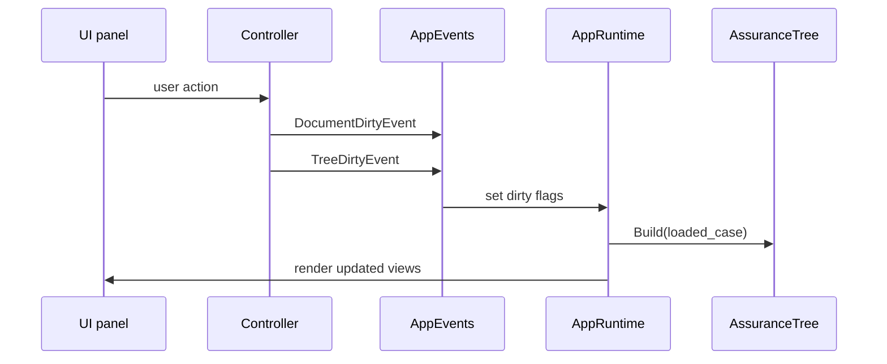

# Runtime and State

`app::AppRuntime` is the frame-level orchestrator. `app::AppRuntimeState` owns the long-lived state, controllers, services, derived tree, and UI layout values.

## Runtime State

| Field | Purpose |
| --- | --- |
| `app_state` | Loaded case, SACM package, active project, active file, dirty flag, status message. |
| `events` | Dispatches typed app events to subscribers. |
| `problems_manager` | Holds manual, validation, import/export, guideline, and AI problems. |
| `*_controller` | Orchestrates UI actions and core services. |
| `guideline_catalog` | SCCG guideline data used by review workflows and AI prompts. |
| `ai_*` | AI settings, secret storage, HTTP client, provider, service, and task runner. |
| `current_tree` | Derived hierarchy built from `app_state.loaded_case`. |
| `tree_needs_rebuild` | Marks `current_tree` stale after model changes. |
| layout ratios | Persisted frame layout sizes for side panels and bottom panel. |

`core::AppState` owns the loaded data:

| Field | Purpose |
| --- | --- |
| `loaded_case` | Flat parser model for UI and derived views. |
| `sacm_package` | Typed SACM package used by save. |
| `current_project` | Open project manifest and tracked file state. |
| `active_project_file_path` | Active file inside a project. |
| `loaded_file_path` | Loaded standalone or project SACM file. |
| `has_unsaved_changes` | Document dirty state. |

## Frame Flow

## Event Bus

`app::AppEvents` stores subscribers and dispatches `std::variant` events.

| Event | Meaning |
| --- | --- |
| `StatusMessageEvent` | Replace the status message shown by the app. |
| `TreeDirtyEvent` | Rebuild `current_tree` from the parser model. |
| `DocumentDirtyEvent` | Mark document state dirty. |
| `ReviewItemsDirtyEvent` | Mark review item storage dirty. |
| `ProjectFilesChangedEvent` | Project manifest or tracked file state changed. |
| `ActiveModelChangedEvent` | A new model is loaded and derived views must refresh. |
| `SelectionChangedEvent` | Selected element changed. |
| `CenterRequestEvent` | Focus the GSN canvas or register tab. |
| `ProposalModeChangedEvent` | Proposal creator or preview mode changed. |
| `ProposalHighlightEvent` | Highlight or dim proposal-related nodes. |
| `ModalRequestEvent` | Open or close a modal/window. |

## Dirty State

Only the parser model and SACM package are durable editing state. Tree, GSN layout, register rows, and proposal preview state are derived.