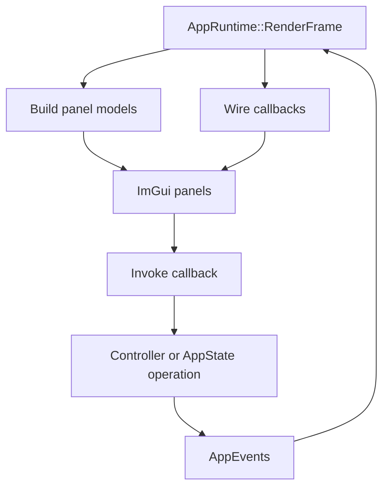
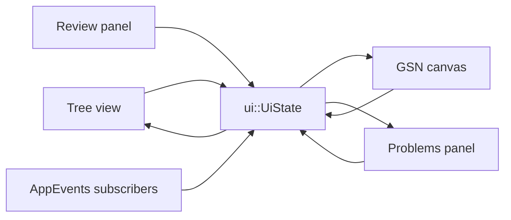
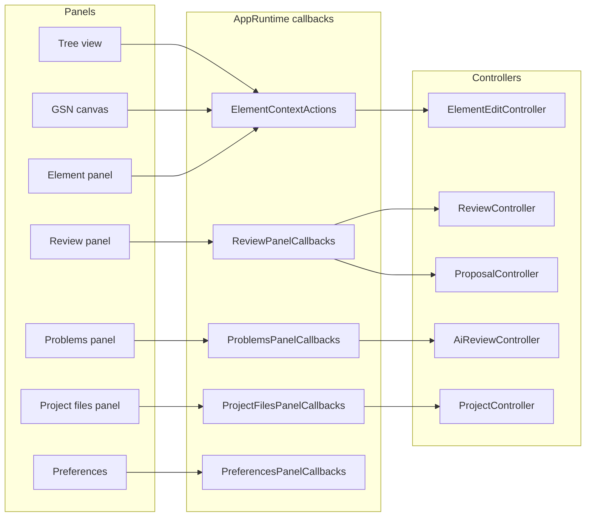

# UI Panels

The UI layer renders Dear ImGui views. Most panels receive data models and callbacks from `AppRuntime`, and controllers perform the business work. The main exception is the element properties panel, which edits the active parser element directly and syncs those field changes back into the SACM package.

## Panel Inventory

| View | Main API | Reads | Writes through |
| --- | --- | --- | --- |
| Tree view | `ui::ShowTreeViewPanel` | `core::AssuranceTree`, parser model, `ui::UiState` | `ElementContextActions`, selection state. |
| GSN canvas | `ui::gsn::ShowGsnCanvasContent` | `core::AssuranceTree`, parser model, `ui::UiState` | `ElementContextActions`, selection state. |
| Element panel | `ui::panels::ShowElementPanel` | Selected parser element and SACM package | Direct in-panel edits plus `sync_to_sacm()`, then AppRuntime emits dirty events. |
| Problems panel | `ui::panels::ShowProblemsPanel` | `core::ProblemsManager`, `ui::UiState` | Problem activation and AI review callbacks. |
| Review panel | `ui::panels::ShowReviewPanel` | Review items, guidelines, proposal validity | Review/proposal callbacks. |
| Project files panel | `ui::panels::ShowProjectFilesPanel` | `core::AssuranceProject` | Add/open file callbacks. |
| SACM viewer panel | `ui::panels::ShowSacmViewerPanel` | `core::AppState`, directory buffers, XML file list | Scan/load callbacks. Defined in the codebase, but not mounted in the current `RenderFrame()` layout. |
| Preferences window | `ui::panels::ShowPreferencesWindow` | AI settings, language, FPS, reviewer name | Settings, API key, language, FPS callbacks. |
| Welcome modal | `ui::panels::ShowWelcomeModal` | Recent project list | Create/open/import callbacks. |
| CSE register | `ui::ShowCseRegisterView` | Register rows derived from parser model | None. |
| Evidence register | `ui::ShowEvidenceRegisterView` | Register rows derived from parser model | None. |

## Shared UI State

`ui::UiState` holds cross-panel view state such as selected element, problem filter, proposal highlights, marked-for-removal nodes, center requests, and proposal canvas flags.

## Panel Communication

## Center Views

The center area has three views:

| View | Source |
| --- | --- |
| GSN canvas | `core::AssuranceTree` pushed through `ui::gsn::SetCanvasTree`. |
| CSE register | Rows rebuilt from `parser::AssuranceCase`. |
| Evidence register | Rows rebuilt from `parser::AssuranceCase`. |

`CenterRequestEvent` can force a tab and optionally center on the current selection or marked proposal nodes.

## Context Actions

Tree and canvas context menus share `ui::ElementContextActions`:

| Callback | Used for |
| --- | --- |
| `add_child` | Add a child claim, strategy, solution, context, assumption, or justification. |
| `add_top_goal` | Add a root claim. |
| `remove_selected` | Remove selected node only or node plus descendants. |
| `not_implemented` | Route unavailable commands to the modal system. |

Panels do not own project or document state. They render current state, collect input, and call callbacks.

The current main-frame layout is:

- Left top: project files panel
- Left bottom: safety case tree
- Center: GSN canvas or register tabs
- Bottom center: problems panel
- Right top: element properties
- Right bottom: review panel