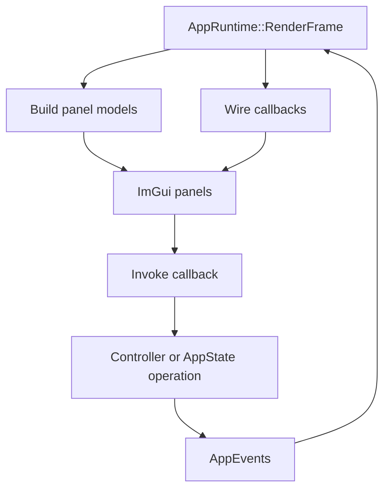
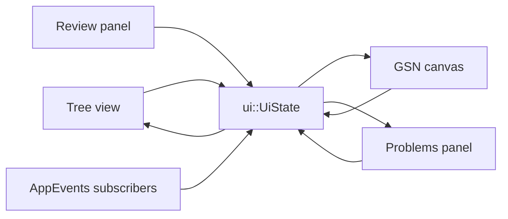
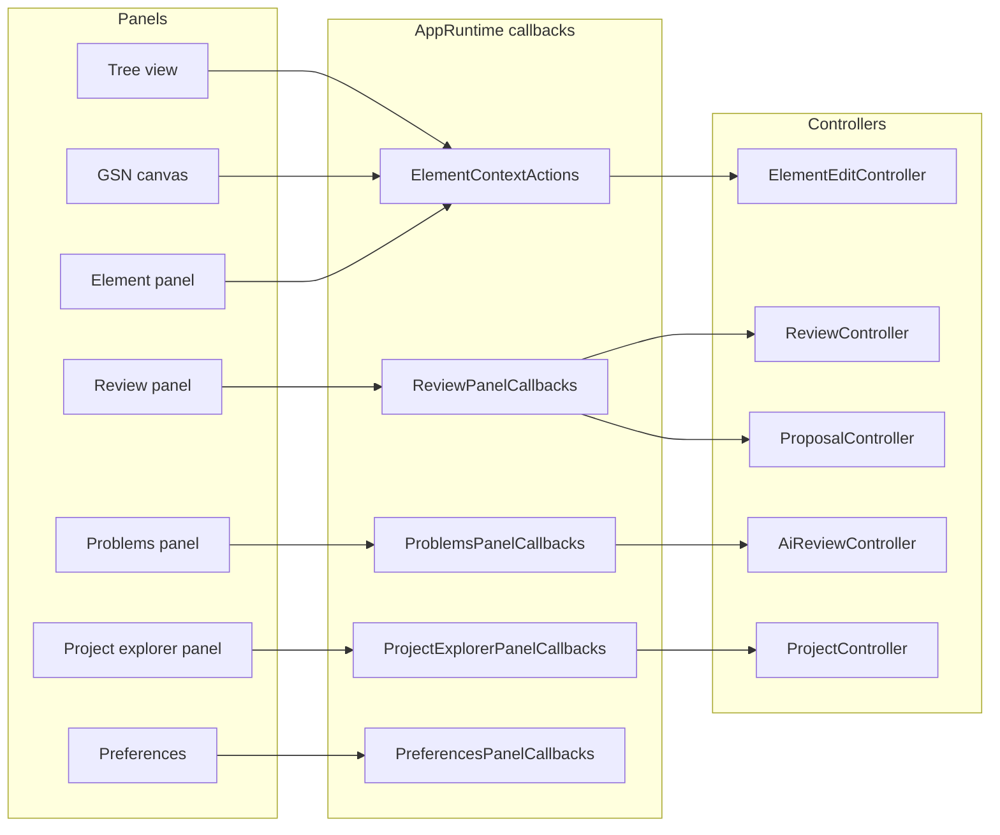

# UI Panels

The UI layer renders Dear ImGui views. Most panels receive data models and callbacks from `AppRuntime`, and controllers perform the business work. The main exception is the element properties panel, which edits the active parser element directly and syncs those field changes back into the SACM package.

The application frame is organized around named UI areas documented in [App Shell and UI Areas](app-shell.md): `ProjectExplorerArea`, `ArgumentNavigatorArea`, `WorkbenchArea`, `InspectorArea`, and `FeedbackDockArea`. These names describe responsibility instead of current screen position.

## Panel Inventory

| View | Main API | Reads | Writes through |
| --- | --- | --- | --- |
| Tree view | `ui::ShowTreeViewPanel` | `core::AssuranceTree`, parser model, `ui::UiState` | `ElementContextActions`, selection state. |
| GSN canvas | `ui::gsn::ShowGsnCanvasContent` | `core::AssuranceTree`, parser model, `ui::UiState` | `ElementContextActions`, selection state. |
| Element panel | `ui::panels::ShowElementPanel` | Selected parser element and SACM package | Direct in-panel edits plus `sync_to_sacm()`, then AppRuntime emits dirty events. |
| Problems panel | `ui::panels::ShowProblemsPanel` | `core::ProblemsManager`, `ui::UiState` | Problem activation and AI review callbacks. |
| Review panel | `ui::panels::ShowReviewPanel` | Review items, guidelines, proposal validity | Review/proposal callbacks. |
| Case Explorer panel | `ui::panels::ShowProjectExplorerPanel` | `core::AssuranceProject`, `core::ProjectSummary`, SACM package trees | Workflow navigation, add/open file callbacks, and advanced package actions. |
| Project overview panel | `ui::panels::ShowProjectOverviewPanel` | `core::ProjectSummary` | Navigation to arguments, evidence, reviews, and conformance. |
| SACM viewer panel | `ui::panels::ShowSacmViewerPanel` | `core::AppState`, directory buffers, XML file list | Scan/load callbacks. Defined in the codebase, but not mounted in the current `RenderFrame()` layout. |
| Relationship panel | `ui::panels::ShowRelationshipPanel` | The selected relationship | Relationship edit callbacks. |
| ACP panel | `ui::panels::ShowAcpPanel` | Assurance claim points on the selection | ACP create/open/remove callbacks. |
| Confidence panel | `ui::panels::ShowConfidencePanel` | The selected element's confidence assessment | Embedded in the element panel; assessment callbacks. |
| Draft changes panel | `ui::panels::RenderDraftChangesPanel` | The working draft's unaccepted changes and their provenance | Accept, discard and navigate callbacks. |
| History timeline panel | `ui::panels::ShowHistoryTimeline*` | Audit transactions, baselines, snapshots | Pin, preview and restore callbacks. |
| Terminology usages panel | `ui::panels::ShowTerminologyUsagesPanelContent` | Detected term usages | Promote-to-context and navigation callbacks. |
| Terminology package panel | `ui::panels::ShowTerminologyPackagePanel` | The selected SACM terminology package | Term and category edit callbacks. |
| Package details panel | `ui::panels::ShowPackageDetailsPanel` | The selected SACM package-tree node | Package edit callbacks. |
| Toolbar | `ui::panels::ShowToolbar` | Project dirty state, canvas state | `ToolbarAction` callbacks (open, save, undo, fit to view, export SVG, preferences). |
| Status bar | `ui::panels::ShowStatusBar` | Project name, save state, problem counts | Problem-panel and document callbacks. |
| Preferences window | `ui::panels::ShowPreferencesWindow` | AI settings, review settings, MCP server settings, language, FPS, reviewer name | Settings, API key, language, FPS callbacks. |
| Welcome modal | `ui::panels::ShowWelcomeModal` | Recent project list | Create/open/import callbacks. |
| CSE register | `ui::ShowCseRegisterView` | Register rows derived from parser model | Assessment column edits and *locate in argument*, through register callbacks into audited commands (or draft operations while a draft is open). |
| Evidence register | `ui::ShowEvidenceRegisterView` | Register rows derived from parser model | Column edits, location browse/open, add evidence, link and unlink — through register callbacks into audited commands (or draft operations while a draft is open). |

## Area Mapping

| Area | Current panels and views |
| --- | --- |
| `ProjectExplorerArea` | Role-based Case Explorer; raw SACM package tree and files appear under Advanced. |
| `ArgumentNavigatorArea` | Argument navigator tree view. |
| `WorkbenchArea` | GSN canvas, CSE register, evidence register, package details, and terminology package tabs. |
| `InspectorArea` | Element properties panel (with the embedded confidence panel), relationship panel, ACP panel, and proposal element editor. |
| `FeedbackDockArea` | Problems, Term Usages, Review and History tabs; a Draft Changes tab only while a working draft exists; an AI Debug tab only when developer tools are switched on. |
| `ModalHost` | Welcome, project, terminology, review confirmation, preferences, theme tweaks, and save-before-exit modals. |

## Shared UI State

`ui::UiState` holds cross-panel view state such as selected element, problem filter, proposal highlights, marked-for-removal nodes, center requests, and proposal canvas flags.

## Panel Communication

## Center Views

The center area has these primary views:

| View | Source |
| --- | --- |
| Project overview | Project, argument, evidence, review, proposal, problem, conformance, and report summary counts. |
| GSN canvas | `core::AssuranceTree` pushed through `ui::gsn::SetCanvasTree`. One tab per open argument package, titled after the package. |
| CSE register | Rows rebuilt from `parser::AssuranceCase`. |
| Evidence register | Rows rebuilt from `parser::AssuranceCase`. |
| Package details | The selected SACM package-tree node. |
| Terminology package | The selected SACM terminology package. |

`CenterRequestEvent` can force a tab and optionally center on the current selection or marked proposal nodes.

## Context Actions

Tree and canvas context menus share `ui::ElementContextActions`:

| Callback | Used for |
| --- | --- |
| `add_child` | Add a child claim, strategy, solution, context, assumption, or justification. |
| `add_top_goal` | Add a root claim. |
| `remove_selected` | Remove selected node only or node plus descendants. |
| `not_implemented` | Route unavailable commands to the modal system. |

Panels do not own project or document state. They render current state, collect input, and call callbacks.

The current main-frame layout is:

- Project explorer: role-based Case Explorer
- Argument navigator: argument tree
- Workbench: GSN canvas, register tabs, package details, or terminology package tabs
- Inspector: element properties
- Feedback dock: problems, term usages, review, and AI debug tabs
