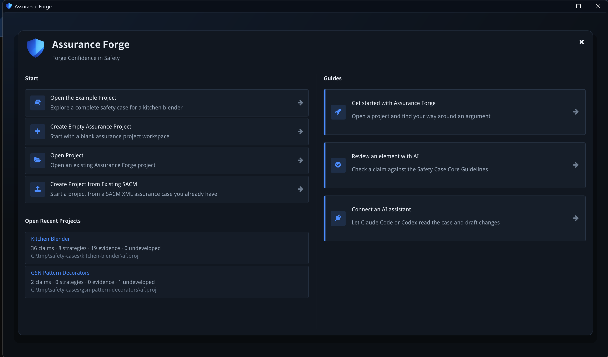

# Open a project

Assurance Forge opens on the welcome screen. It is also reachable later from
**View → Welcome Screen**.



## Start

| Action | What it does |
|---|---|
| **Create Empty Assurance Project** | Asks for a name and a location, and creates a project with an empty argument file. |
| **Create Assurance Project from Template** | **Not implemented yet** — the button reports so and does nothing. |
| **Open Project** | Opens an OS file picker for an existing `af.proj`. |
| **Create Project from Existing SACM** | Asks for a SACM file (`.sacm` or `.xml`), then a location, then a name (the file's own name is offered). The project's first argument is a **copy** of that file under `arguments/`; the original is not touched. A file the SACM library cannot load is refused with the library's reason, and no project folder is left behind. |

Once a project is open, **File → Import SACM File...** copies another SACM file
into it as a further tracked argument, asks what to call the copy (a name the
project already tracks is refused rather than overwritten), and opens it. Both
imports copy the bytes as they are — the SACM file is the argument, and an import
that rewrote it would be a silent edit. Neither carries anything but the one
argument file: registers, review state and audit history of a source project are
not merged. To work on an existing Assurance Forge project, use **Open Project**.
The MCP server also accepts a bare `.sacm` path (`--project`), read-only.

The three **Walkthroughs** cards are likewise placeholders at present; they
report that walkthroughs are not yet implemented.

## Open Recent Projects

Each entry shows the project name, its claim / strategy / evidence / undeveloped
counts as of the last time it was open, and its path. The list is ordered by
**last opened**, so an entry's position changes as you work.

## What a project holds

A project is a directory with an `af.proj` manifest beside the files it tracks:

```text
my-case/
  af.proj                     the manifest: tracked files, roles, hashes, settings
  arguments/main.sacm         the argument — SACM 2.3 XML, the source of truth
  analysis/confidence.af.json confidence assessments, when used
  reviews/review-items.af.json review state
  .af/                        audit log, backups, snapshots, working drafts (not for hand-editing)
```

The manifest records a hash per tracked file, so a file changed outside the
application is detected and reported rather than silently absorbed. Details are
in [project storage](../architecture/project-storage.md).

**The SACM file is the argument.** Everything the tool writes elsewhere is
derived, recorded state — never a second copy of the argument.

## Saving

**File → Save Project** (or the toolbar's save icon) writes the tracked files.
The status bar shows *Saved* or *Unsaved changes*, and closing with unsaved work
asks before exiting. Edits are applied through an audited command bus, so
**Edit → Undo** (`Ctrl+Z`) steps back through them; see
[Review an element](review-an-element.md#history) for what that history records.
